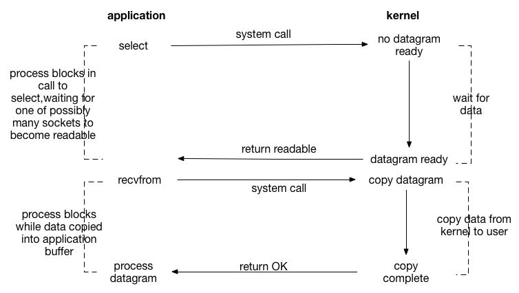

# IO多路复用--python实战

## IO多路复用的概念

原生socket客户端在与服务端建立连接时，即服务端调用accept方法时是阻塞的，同时服务端和客户端在收发数据(调用recv、send、sendall)时也是阻塞的。原生socket服务端在同一时刻只能处理一个客户端请求，即服务端不能同时与多个客户端进行通信，实现并发，导致服务端资源闲置(此时服务端只占据 I/O，CPU空闲)。

现在的需求是：我们要让多个客户端连接至服务器端，而且服务器端需要处理来自多个客户端请求。很明显，原生socket实现不了这种需求，此时我们该采用什么方式来处理呢？

解决方法：采用I/O多路复用机制。在python网络编程中，I/O多路复用机制就是用来解决多个客户端连接请求服务器端，而服务器端能正常处理并响应给客户端的一种机制。书面上来说，就是通过1种机制：可以同时监听多个文件描述符，一旦描述符就绪，能够通知程序进行相应的读写操作。




 <mark> **I/O多路复用是指**：通过一种机制，可以**监视多个描述符**，一旦某个描述符就绪（一般是读就绪或者写就绪），能够通知程序进行相应的读写操作。</mark>


## Linux中的IO多路复用

### select

select最早于1983年出现在4.2BSD中，它**通过一个select()系统调用来监视多个文件描述符的数组，当select()返回后，该数组中就绪的文件描述符便会被内核修改标志位，使得进程可以获得这些文件描述符从而进行后续的读写操作。**

select目前几乎在所有的平台上支持，其良好跨平台支持也是它的一个优点，事实上从现在看来，这也是它所剩不多的优点之一。

  select的一个缺点在于单个进程能够监视的文件描述符的数量存在最大限制，在Linux上一般为1024，不过可以通过修改宏定义甚至重新编译内核的方式提升这一限制。

  另外，select()所维护的存储大量文件描述符的数据结构，随着文件描述符数量的增大，其复制的开销也线性增长。同时，由于网络响应时间的延迟使得大 量TCP连接处于非活跃状态，但**调用select()会对所有socket进行一次线性扫描**，所以这也浪费了一定的开销。


### poll

poll在1986年诞生于System V Release 3，它和select在本质上没有多大差别，但是poll没有最大文件描述符数量的限制。

poll和select同样存在一个**缺点**就是，**包含大量文件描述符的数组被整体复制于用户态和内核的地址空间之间**，而不论这些文件描述符是否就绪，它的开销随着文件描述符数量的增加而线性增大。

另外，select()和poll()将就绪的文件描述符告诉进程后，如果进程没有对其进行IO操作，那么下次调用select()和poll()的时候 将 再次报告这些文件描述符，所以它们一般不会丢失就绪的消息，这种方式称为水平触发（Level Triggered）。


### epoll

直到Linux2.6才出现了由内核直接支持的实现方法，那就是epoll，它几乎具备了之前所说的一切优点，被公认为Linux2.6下性能最好的多路I/O就绪通知方法。

epoll可以同时支持**水平触发**和**边缘触发**（**Edge Triggered**，只告诉进程哪些文件描述符刚刚变为就绪状态，它只说一遍，如果我们没有采取行动，那么它将不会再次告知，这种方式称为边缘触发），理论上边缘触发的性能要更高一些，但是代码实现相当复杂。

epoll同样只告知那些就绪的文件描述符，而且当我们调用epoll_wait()获得就绪文件描述符时，返回的不是实际的描述符，而是一个代表就绪描 述符数量的 值，你只需要去epoll指定的一个数组中依次取得相应数量的文件描述符即可，这里也使用了内存映射（mmap）技术，这样便彻底省掉了这些文件描述符在 系统调用时复制的开销。

另一个**本质的改进在于epoll采用基于事件的就绪通知方式**。在select/poll 中，进程只有在调用一定的方法后，内核才对所有监视的文件描述符进行扫描，而**epoll事先通过epoll_ctl()来注册一个文件描述符，一旦基于某 个文件描述符就绪时，内核会采用类似callback的回调机制，迅速激活这个文件描述符，当进程调用epoll_wait()时便得到通知。**


## python中的IO多路复用

Python中有一个select模块，其中提供了：select、poll、epoll三个方法，分别调用系统的 select，poll，epoll从而实现IO多路复用。

- Windows Python：提供： select
- Mac Python：提供： select
- Linux Python：提供： select、poll、epoll


**IO多路复用**有些地方也称这种IO方式为**事件驱动IO(event driven IO)**。我们都知道，select/epoll的好处就在于**单个process就可以同时处理多个网络连接的IO**。<span style="color:red">它的基本原理就是select /epoll这个function会不断的轮询所负责的所有socket，当某个socket有数据到达了，就通知用户进程。</span>

它的流程如图：


Python中有一个select模块，其中提供了：select、poll、epoll三个方法(根据系统的不同，select模块提供了不同的方法，在linux中select模块提供了全部三种方法)，分别调用系统的 select，poll，epoll从而实现IO多路复用。

**注意：网络操作、文件操作、终端操作等均属于IO操作，对于windows只支持Socket操作，其他系统支持其他IO操作，但是无法检测普通文件操作,自动检测文件是否已经变化。**

普通文件操作，所有系统都是完成不了的，普通文件是属于I/O操作！但是对于python来说文件变更，python是监控不了的，所以我们能用的只有是“终端的输入输出，Socket的输入输出”


### select

**select 的中文含义是”选择“，select机制也如其名，监听一些 server 关心的套接字、文件等对象，关注他们是否可读、可写、发生异常等事件。一旦出现某个 select 关注的事件，select 会对相应的套接字或文件进行特定的处理，这就是 select 机制最主要的功能。**


<span style="color:red">select 机制可以只使用一个进程/线程来处理多个socket或其他对象，因此又被称为I/O复用。</span>

<span style="color:red">**关于select机制的进程阻塞形式，与普通的套接字略有不同。**</span>`socket`对象可能阻塞在`accept()`,`recvfrom()`等方法上，以`recvfrom()`方法为例，当执行到`socket.recvfrom()`这一句时，就会调用一个系统调用询问内核：`client/server`发来的数据包准备好了没？此时从进程空间切換到内核地址空间，内核可能需要等数据包完全到达，然后将数据复制到程序的地址空间后，`recvfrom()`才会返回，接下来进程继续执行，对读取到的数据进行必要的处理。

而使用`select`函数编程时，同样针对上面的`recvfrom()`方法，进程会阻塞在`select()`调用上，等待出现一个或多个套接字对象满足可读事件，当内核将数据准备好后，`select()`返回某个套接字对象可读这一条件，随后再调用`recvfrom()`将数据包从内核复制到进程地址空间。

所以可见，如果仅仅从单个套接字的处理来看，`select()`反倒性能更低，**因为`select`机制使用两个系统调用。**<span style="color:green">但`select`机制的优势就在于它可以同时等待多个fd就绪，而当某个fd发生满足我们关心的事件时，就对它执行特定的操作。</span>

```python
句柄列表11, 句柄列表22, 句柄列表33 = select.select(句柄列表1, 句柄列表2, 句柄列表3, 超时时间)

参数： 可接受四个参数（前三个必须）
返回值：三个列表

select方法用来监视文件句柄，如果句柄发生变化，则获取该句柄。
1、当 参数1 序列中的句柄发生可读时（accetp和read），则获取发生变化的句柄并添加到 返回值1 序列中
2、当 参数2 序列中含有句柄时，则将该序列中所有的句柄添加到 返回值2 序列中
3、当 参数3 序列中的句柄发生错误时，则将该发生错误的句柄添加到 返回值3 序列中
4、当 超时时间未设置，则select会一直阻塞，直到监听的句柄发生变化
5、当 超时时间＝1时，那么如果监听的句柄均无任何变化，则select会阻塞1秒，之后返回三个空列表，如果监听的句柄有变化，则直接执行。
```

<span style="color:red">由于select()接口可以同时对多个句柄进行读状态、写状态和错误状态的探测</span>，所以可以很容易构建为多个客户端提供独立问答服务的服务器系统。这里需要指出的是，客户端的一个connect()操作，将在服务器端激发一个“可读事件”，所以 select() 也能探测来自客户端的connect()行为。

上述模型中，**最关键的地方是如何动态维护select()的三个参数**。程序员需要检查对应的返回值列表，以确定到底哪些句柄发生了事件。所以如果select()发现某句柄捕捉到了“可读事件”，服务器程序应及时做recv()操作，并根据接收到的数据准备好待发送数据，并将对应的句柄值加入句柄序列1，准备下一次的“可写事件”的select()探测。同样，如果select()发现某句柄捕捉到“可写事件”，则程序应及时做send()操作，并准备好下一次的“可读事件”探测准备。


`实例1：利用select监听终端输入`

```python
import select
import sys


"""
注：
1、[sys.stdin,]以后不管是列表还是元组，在最后一个元素的后面建议增加一个逗号，（1，） | （1） 这两个有区别吗？是不是第二个更像方法的调用或者函数
    的调用，加个，是不是更容易分清楚。还有就是在以后写django的配置文件的时候，他是必须要加的。
2、select的第一个参数就是要监听的文件句柄，只要监听的文件句柄有变化，那么就会将其加入到返回值readable列表中。
3、select最后一个参数1是超时时间，当执行select时，如果监听的文件句柄没有变化，则会阻塞1秒，然后向下继续执行；默认timeout=None，
    就是会一直阻塞，直到感知到变化
"""


def monitor_stdin():
    while True:
        """
        select.select([sys.stdin,],[],[],1)用到I/O多路复用，第一个参数是列表，sys.stdin是系统标准输入的文件描述符, 就是打开标准输入终端返回
        的文件描述符，一旦终端有输入操作，select就感知sys.stdin描述符的变化，那么会将变化的描述符sys.stdin添加到返回值readable中；
        如果终端一直没有输入，那么readable他就是一个空列表
        """
        readable, writeable, error = select.select([sys.stdin, ], [], [])

        if sys.stdin in readable:
            print("select get stdin", sys.stdin.readline())


if __name__ == '__main__':
    monitor_stdin()
```


`实例2：利用select监听浏览器访问`

```python
import socket
import select


def browser_monitor():
    # 生成socket对象
    sk = socket.socket(socket.AF_INET, socket.SOCK_STREAM)
    # 绑定IP和端口
    sk.bind(('0.0.0.0', 8000))
    # 监听，并设置最大连接数为5
    sk.listen(5)
    # 设置setblocking为False，即非阻塞模式，accept将不在阻塞，如果没有收到请求就会报错
    sk.setblocking(False)

    while True:
        rlist, wlist, elist = select.select([sk, ], [], [], 2)  # 监听第一个列表的文件描述符，如果其中有文件描述符发生改变，则捕获并放到rlist中
        for r in rlist:  # 如果rlist非空将执行，否则不执行
            conn, addr = r.accept()  # 建立连接，生成客户端的socket对象以及IP地址和端口号
            print(addr)


if __name__ == '__main__':
    browser_monitor()
```

执行程序，在浏览器中输入地址：`127.0.0.1:8000`


`实例3：利用select监听多端口`

```python
import socket
import select


def browser_monitor():
    # 生成socket对象
    sk = socket.socket(socket.AF_INET, socket.SOCK_STREAM)
    # 绑定IP和端口
    sk.bind(('0.0.0.0', 8000))
    # 监听，并设置最大连接数为5
    sk.listen(5)
    # 设置setblocking为False，即非阻塞模式，accept将不在阻塞，如果没有收到请求就会报错
    sk.setblocking(False)

    sk2 = socket.socket(socket.AF_INET, socket.SOCK_STREAM)
    sk2.bind(('0.0.0.0', 8006))
    sk2.listen(5)
    sk2.setblocking(False)

    while True:
        rlist, wlist, elist = select.select([sk, sk2], [], [], 2)  # 监听第一个列表的文件描述符，如果其中有文件描述符发生改变，则捕获并放到rlist中
        for r in rlist:  # 如果rlist非空将执行，否则不执行
            conn, addr = r.accept()  # 建立连接，生成客户端的socket对象以及IP地址和端口号
            print(addr)


if __name__ == '__main__':
    browser_monitor()

```


`实例4：利用select实现伪同时处理多个Socket客户端请求—服务端`

```python
import socket
import select
import time


def server():
    sk = socket.socket(socket.AF_INET, socket.SOCK_STREAM)
    sk.bind(('0.0.0.0', 8000))
    sk.listen(5)
    sk.setblocking(False)
    inputs = [sk, ]

    while True:
        rlist, wlist, elist = select.select(inputs, [], [], 1)
        time.sleep(2)
        print("inputs list:", inputs)
        print("file descriptor:", rlist)

        for r in rlist:
            if r == sk:
                # 当客户端第1次连接服务端时
                conn, address = r.accept()
                inputs.append(conn)
                print(address)
            else:
                # 当客户端连接上服务端之后，再次发送数据时
                client_data = r.recv(1024)
                r.sendall(client_data)


if __name__ == '__main__':
    server()
```


`实例4：利用select实现伪同时处理多个Socket客户端请求—客户端`

```python
import socket


def run_client():
    client = socket.socket()
    client.connect(('127.0.0.1', 8000))
    client.settimeout(5)

    while True:
        client_input = input("please input message:").strip()
        client.sendall(client_input.encode('utf-8'))
        server_data = client.recv(1024)
        print(server_data)


if __name__ == '__main__':
    run_client()
```


`实例5：实例4服务端的优化`

```python

```


### Queue


