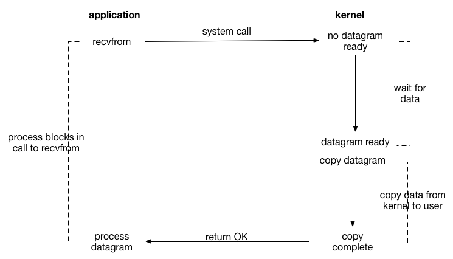
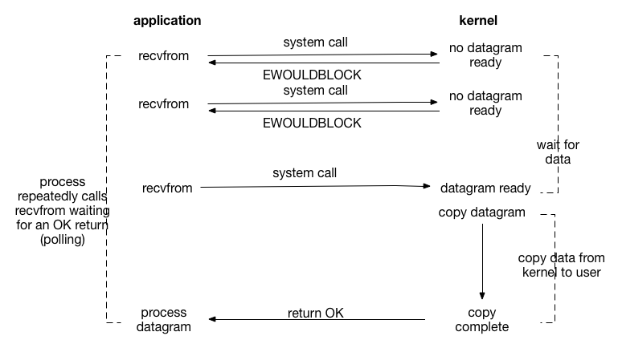
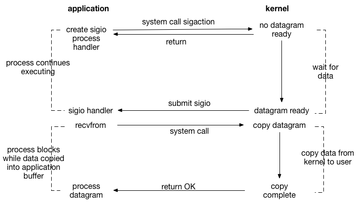
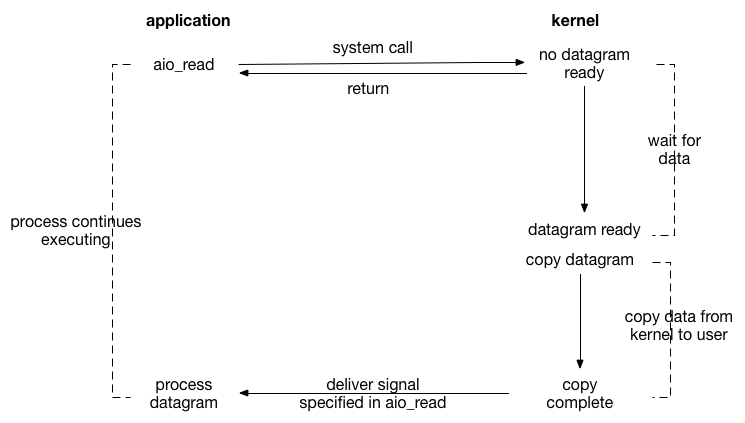
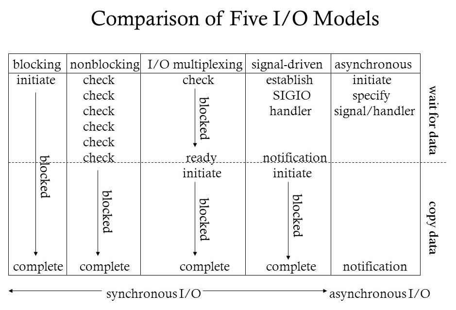
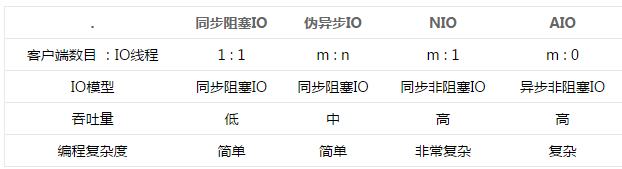

# Linux的5种IO模型详解

## 概念说明

- 用户空间和内核空间
- 进程切换
- 进程的阻塞
- 文件描述符
- 缓存 I/O


### 用户空间与内核空间

现在操作系统都是采用虚拟存储器，那么对32位操作系统而言，它的寻址空间（虚拟存储空间）为4G（2的32次方）。操作系统的核心是内核，独立于普通的应用程序，可以访问受保护的内存空间，也有访问底层硬件设备的所有权限。<mark>**为了保证用户进程不能直接操作内核（kernel），保证内核的安全，操心系统将虚拟空间划分为两部分，一部分为内核空间，一部分为用户空间。**</mark>针对linux操作系统而言，将最高的1G字节（从虚拟地址`0xC0000000`到`0xFFFFFFFF`），供内核使用，称为内核空间，而将较低的3G字节（从虚拟地址`0x00000000`到`0xBFFFFFFF`），供各个进程使用，称为用户空间。


### 进程切换

<mark>**为了控制进程的执行，内核必须有能力挂起正在CPU上运行的进程，并恢复以前挂起的某个进程的执行。**</mark>这种行为被称为进程切换。因此可以说，任何进程都是在操作系统内核的支持下运行的，是与内核紧密相关的。

从一个进程的运行转到另一个进程上运行，这个过程中经过下面这些变化：

1. 保存处理机上下文，包括程序计数器和其他寄存器
2. 更新PCB信息
3. 把进程的PCB移入相应的队列，如就绪、在某事件阻塞等队列
4. 选择另一个进程执行，并更新其PCB
5. 更新内存管理的数据结构
6. 恢复处理机上下文

**进程间切换很耗资源**


### 进程的阻塞

正在执行的进程，由于期待的某些事件未发生，如请求系统资源失败、等待某种操作的完成、新数据尚未到达或无新工作做等，则由系统自动执行阻塞原语(Block)，使自己由运行状态变为阻塞状态。可见，进程的阻塞是进程自身的一种主动行为，也因此只有处于运行态的进程（获得CPU），才可能将其转为阻塞状态。<mark>`当进程进入阻塞状态，是不占用CPU资源的`。</mark>


### 文件描述符fd

**文件描述符（File descriptor）**是计算机科学中的一个术语，**是一个用于表述指向文件的引用的抽象化概念**。

**文件描述符在形式上是一个非负整数。实际上，它是一个索引值，指向内核为每一个进程所维护的该进程打开文件的记录表。**当程序打开一个现有文件或者创建一个新文件时，内核向进程返回一个文件描述符。在程序设计中，一些涉及底层的程序编写往往会围绕着文件描述符展开。但是文件描述符这一概念往往只适用于UNIX、Linux这样的操作系统。


### 缓存I/O

缓存 I/O 又被称作标准 I/O，大多数文件系统的默认 I/O 操作都是缓存 I/O。在 Linux 的缓存 I/O 机制中，操作系统会将 I/O 的数据缓存在文件系统的页缓存（ page cache ）中，也就是说，**数据会先被拷贝到操作系统内核的缓冲区中，然后才会从操作系统内核的缓冲区拷贝到应用程序的地址空间。**


**缓存 I/O 的缺点：**

数据在传输过程中需要在应用程序地址空间和内核进行多次数据拷贝操作，这些数据拷贝操作所带来的 CPU 以及内存开销是非常大的。


## IO模型

对于一次IO访问（以read举例），**数据会先被拷贝到操作系统内核的缓冲区中，然后才会从操作系统内核的缓冲区拷贝到应用程序的地址空间**。所以说，当一个read操作发生时，它会经历两个阶段：

1. 等待数据准备 (Waiting for the data to be ready)
2. 将数据从内核拷贝到进程中 (Copying the data from the kernel to the process)


正是因为这两个阶段，linux系统产生了下面五种网络模式的方案：

1. 阻塞IO(Blocking IO)
2. 非阻塞IO(Nonblocking IO)
3. IO多路复用(IO multiplexing)
4. 信号驱动IO(Signal Driven IO)
5. 异步IO(Asynchronous IO)

注：由于signal driven IO在实际中并不常用，所以我这只提及剩下的四种IO Model。


### Blocking IO

在linux中，默认情况下所有的socket都是blocking，一个典型的读操作流程大概是这样：



当用户进程调用了`recvfrom`这个系统调用，`kernel`就开始了`IO`的第一个阶段：准备数据（对于网络IO来说，很多时候数据在一开始还没有到达。比如，还没有收到一个完整的`UDP`包。这个时候kernel就要等待足够的数据到来）。这个过程需要等待，也就是说数据被拷贝到操作系统内核的缓冲区中是需要一个过程的。而在用户进程这边，整个进程会被阻塞（当然，是进程自己选择的阻塞）。当kernel一直等到数据准备好了，它就会将数据从kernel中拷贝到用户内存，然后kernel返回结果，用户进程才解除block的状态，重新运行起来。

> 所以，blocking IO的特点就是在IO执行的两个阶段都被block了。


### Nonblocking IO

linux下，可以通过设置socket使其变为non-blocking。当对一个non-blocking socket执行读操作时，流程是这个样子：



当用户进程发出read操作时，如果kernel中的数据还没有准备好，那么它并不会block用户进程，而是立刻返回一个error。从用户进程角度讲 ，它发起一个read操作后，并不需要等待，而是马上就得到了一个结果。用户进程判断结果是一个error时，它就知道数据还没有准备好，于是它可以再次发送read操作。一旦kernel中的数据准备好了，并且又再次收到了用户进程的system call，那么它马上就将数据拷贝到了用户内存，然后返回。

> 所以，nonblocking IO的特点是用户进程需要**不断的主动询问**kernel数据好了没有。


### IO multiplexing

**IO multiplexing**就是我们说的`select`，`poll`，`epoll`，有些地方也称这种IO方式为`event driven IO`。<mark>`select/epoll`**的好处就在于单个process就可以同时处理多个网络连接的IO**</mark>。它的基本原理就是`select`，`poll`，`epoll`这个`function`会不断的轮询所负责的所有`socket`，当某个`socket`有数据到达了，就通知用户进程。


`当用户进程调用了select，那么整个进程会被block`，而同时，kernel会“监视”所有select负责的socket，当任何一个socket中的数据准备好了，select就会返回。这个时候用户进程再调用read操作，将数据从kernel拷贝到用户进程。

> 所以，I/O 多路复用的特点是通过一种机制一个进程能同时等待多个文件描述符，而这些文件描述符（套接字描述符）其中的任意一个进入读就绪状态，select()函数就可以返回。


这个图和`blocking IO`的图其实并没有太大的不同，事实上，还更差一些。因为这里需要使用两个`system call` (`select `和 `recvfrom`)，而`blocking IO`只调用了一个`system call` (`recvfrom`)。但是，**用`select`的优势在于它可以同时处理多个connection**。


所以，如果处理的连接数不是很高的话，使用`select/epoll`的`web server`不一定比使用`multi-threading + blocking IO`的`web server`性能更好，可能延迟还更大。`select/epoll`的优势并不是对于单个连接能处理得更快，而是在于能处理更多的连接。）


在`IO multiplexing Model`中，实际中，对于每一个`socket`，一般都设置成为`non-blocking`，但是，如上图所示，整个用户的`process`其实是一直被`block`的。只不过`process`是被`select`这个函数`block`，而不是被`socket IO`给`block`。


### Signal Driven IO




### Asynchronous IO

`Linux`下的`asynchronous IO`其实用得很少。先看一下它的流程：



用户进程发起read操作之后，立刻就可以开始去做其它的事。而另一方面，从kernel的角度，当它受到一个asynchronous read之后，首先它会立刻返回，所以不会对用户进程产生任何block。然后，kernel会等待数据准备完成，然后将数据拷贝到用户内存，当这一切都完成之后，kernel会给用户进程发送一个signal，告诉它read操作完成了。


### 小结

#### blocking和non-blocking的区别

调用blocking IO会一直block住对应的进程直到操作完成，而non-blocking IO在kernel还准备数据的情况下会立刻返回。


#### synchronous IO和asynchronous IO的区别

在说明`synchronous IO`和`asynchronous IO`的区别之前，需要先给出两者的定义。`POSIX`的定义是这样子的：

> A synchronous I/O operation causes the requesting process to be blocked until that I/O operation completes;
>
> An asynchronous I/O operation does not cause the requesting process to be blocked;


两者的区别就在于`synchronous IO`做`IO operation`的时候会将`process`阻塞。按照这个定义，之前所述的`blocking IO`，`non-blocking IO`，`IO multiplexing`都属于`synchronous IO`。


有人会说，`non-blocking IO`并没有被`block`啊。这里有个非常“狡猾”的地方，定义中所指的`IO operation`是指真实的IO操作，就是例子中的`recvfrom`这个`system call`。`non-blocking IO`在执行`recvfrom`这个`system call`的时候，如果`kernel`的数据没有准备好，这时候不会`block`进程。但是，<mark>当`kernel`中数据准备好的时候，`recvfrom`会将数据从`kernel`拷贝到用户内存中，这个时候进程是被`block`了，在这段时间内，进程是被`block`的。</mark>


而`asynchronous IO`则不一样，当进程发起`IO操作`之后，就直接返回再也不理睬了，直到`kernel`发送一个信号，告诉进程说`IO`完成。在这整个过程中，进程完全没有被`block`。


#### 5种IO模型对比

**各个IO Model的比较如图所示：**



**5种网络IO对比**

- 只有aio才是全程非阻塞，其它4种都是同步IO。
- 阻塞IO编程简单，这种方式使用很广泛，但是效率较低。
- 非阻塞IO效率较高，但是编程较复杂，有开发语言和代码库支持就简单多了。
- 多路复用非阻塞IO效率比非阻塞IO更高，在大规模的网络IO处理中尤其明显，支持的程序也越来越多。
- 异步IO效率很高，但是编程很复杂。node.js中使用的就是异步IO。




## IO多路复用


`select`，`poll`，`epoll`都是**IO多路复用**的机制。

<mark>**I/O多路复用**就是通过一种机制，一个进程可以**监视多个描述符**，一旦某个描述符就绪（一般是读就绪或者写就绪），能够通知程序进行相应的读写操作。</mark>

但`select`，`poll`，`epoll`本质上都是`同步I/O`，因为他们都需要在读写事件就绪后自己负责进行读写，也就是说这个读写过程是阻塞的，而异步I/O则无需自己负责进行读写，异步I/O的实现会负责把数据从内核拷贝到用户空间。


### select

```c
int select (int n, fd_set *readfds, fd_set *writefds, fd_set *exceptfds, struct timeval *timeout);
```

select 函数监视的文件描述符分3类，分别是`writefds`、`readfds`、和`exceptfds`。调用后select函数会阻塞，直到有描述副就绪（有数据 可读、可写、或者有except），或者超时（timeout指定等待时间，如果立即返回设为null即可），函数返回。当select函数返回后，可以 通过遍历`fdset`，来找到就绪的描述符。


select目前几乎在所有的平台上支持，其良好跨平台支持也是它的一个优点。select的一 个缺点在于单个进程能够监视的文件描述符的数量存在最大限制，在Linux上一般为1024，可以通过修改宏定义甚至重新编译内核的方式提升这一限制，但 是这样也会造成效率的降低。


### poll

```c
int poll (struct pollfd *fds, unsigned int nfds, int timeout);
```

不同与select使用三个位图来表示三个`fdset`的方式，`poll`使用一个 `pollfd`的指针实现。

```c
struct pollfd {
    int fd; /* file descriptor */
    short events; /* requested events to watch */
    short revents; /* returned events witnessed */
};
```

`pollfd`结构包含了要监视的`event`和发生的`event`，不再使用`select` `参数-值`传递的方式。同时，`pollfd`并没有最大数量限制（但是数量过大后性能也是会下降）。 和`select`函数一样，`poll`返回后，需要轮询`pollfd`来获取就绪的描述符。

> 从上面看，select和poll都需要在返回后，`通过遍历文件描述符来获取已经就绪的socket`。事实上，同时连接的大量客户端在一时刻可能只有很少的处于就绪状态，因此随着监视的描述符数量的增长，其效率也会线性下降。


### epoll

`epoll`是在2.6内核中提出的，是之前的select和poll的增强版本。相对于`select`和`poll`来说，`epoll`更加灵活，没有描述符限制。`epoll`使用一个文件描述符管理多个描述符，将用户关系的文件描述符的事件存放到内核的一个事件表中，这样在用户空间和内核空间的`copy`只需一次。


### select和epoll对比

**select不足的地方：**

- 每次select都要把全部句柄赋值到内核
- 内核每次都要遍历全部IO句柄，以判断是否数据准备好
- select模式最大IO句柄数为1024，太多了性能下降明显


**epoll的特点：**

- 每次新建IO句柄(`epoll_create`)才复制并注册(`epoll_ctl`)到内核
- 内核根据IO事件，把准备好的IO句柄放到就绪队列
- 应用只要轮询(`epoll_wait`)就绪队列，然后去读取数据

只需要轮询就绪队列（数量少），不存在select的轮询，也没有内核的轮询，不需要多次复制所有的IO句柄。因此，可以同时支持的IO句柄数轻松过百万


## epoll详解

### epoll操作过程

`epoll`操作过程需要三个接口，分别如下：

```c
int epoll_create(int size)；//创建一个epoll的句柄，size用来告诉内核这个监听的数目一共有多大
int epoll_ctl(int epfd, int op, int fd, struct epoll_event *event)；
int epoll_wait(int epfd, struct epoll_event * events, int maxevents, int timeout);
```

1. `int epoll_create(int size)`

   创建一个`epoll`的句柄，`size`用来告诉内核这个监听的数目一共有多大，这个参数不同于`select()`中的第一个参数，给出最大监听的`fd+1`的值，参数`size`并不是限制了`epoll`所能监听的描述符最大个数，**只是对内核初始分配内部数据结构的一个建议。**
   当创建好`epoll`句柄后，它就会占用一个`fd`值，在`linux`下如果查看`/proc/进程id/fd/`，是能够看到这个`fd`的，所以在使用完`epoll`后，必须调用`close()`关闭，否则可能导致`fd`被耗尽。

2. `int epoll_ctl(int epfd, int op, int fd, struct epoll_event *event)`

   函数是对指定描述符`fd`执行`op`操作。

   \- `epfd`：是`epoll_create()`的返回值。
   \-` op`：表示op操作，用三个宏来表示：添加`EPOLL_CTL_ADD`，删除`EPOLL_CTL_DEL`，修改`EPOLL_CTL_MOD`。分别添加、删除和修改对`fd`的监听事件。
   \-` fd`：是需要监听的`fd（文件描述符）`
   \- `epoll_event`：是告诉内核需要监听什么事，`struct epoll_event`结构如下：

   ```c
   struct epoll_event {
     __uint32_t events;  /* Epoll events */
     epoll_data_t data;  /* User data variable */
   };
   
   //events可以是以下几个宏的集合：
   EPOLLIN ：表示对应的文件描述符可以读（包括对端SOCKET正常关闭）；
   EPOLLOUT：表示对应的文件描述符可以写；
   EPOLLPRI：表示对应的文件描述符有紧急的数据可读（这里应该表示有带外数据到来）；
   EPOLLERR：表示对应的文件描述符发生错误；
   EPOLLHUP：表示对应的文件描述符被挂断；
   EPOLLET： 将EPOLL设为边缘触发(Edge Triggered)模式，这是相对于水平触发(Level Triggered)来说的。
   EPOLLONESHOT：只监听一次事件，当监听完这次事件之后，如果还需要继续监听这个socket的话，需要再次把这个socket加入到EPOLL队列里
   ```

3. `int epoll_wait(int epfd, struct epoll_event * events, int maxevents, int timeout)`

   等待`epfd`上的`io`事件，最多返回`maxevents`个事件。
   参数`events`用来从内核得到事件的集合，`maxevents`告之内核这个`events`有多大，这个`maxevents`的值不能大于创建`epoll_create()`时的`size`，参数`timeout`是超时时间（毫秒，0会立即返回，-1将不确定，也有说法说是永久阻塞）。该函数返回需要处理的事件数目，如返回0表示已超时。


### 工作模式

`epoll`对文件描述符的操作有两种模式：**LT（level trigger）**和**ET（edge trigger）**。

LT模式是默认模式，LT模式与ET模式的区别如下：

- **LT模式**：当`epoll_wait`检测到描述符事件发生并将此事件通知应用程序，**应用程序可以不立即处理该事件**。下次调用`epoll_wait`时，会再次响应应用程序并通知此事件。
- **ET模式**：当`epoll_wait`检测到描述符事件发生并将此事件通知应用程序，**应用程序必须立即处理该事件**。如果不处理，下次调用`epoll_wait`时，不会再次响应应用程序并通知此事件。


#### LT模式

LT(level triggered)是缺省的工作方式，并且同时支持block和no-block socket.在这种做法中，内核告诉你一个文件描述符是否就绪了，然后你可以对这个就绪的fd进行IO操作。如果你不作任何操作，内核还是会继续通知你的。


#### ET模式

ET(edge-triggered)是高速工作方式，只支持no-block socket。在这种模式下，当描述符从未就绪变为就绪时，内核通过epoll告诉你。然后它会假设你知道文件描述符已经就绪，并且不会再为那个文件描述符发送更多的就绪通知，直到你做了某些操作导致那个文件描述符不再为就绪状态了(比如，你在发送，接收或者接收请求，或者发送接收的数据少于一定量时导致了一个EWOULDBLOCK 错误）。但是请注意，如果一直不对这个fd作IO操作(从而导致它再次变成未就绪)，内核不会发送更多的通知(only once)

ET模式在很大程度上减少了epoll事件被重复触发的次数，因此效率要比LT模式高。epoll工作在ET模式的时候，必须使用非阻塞套接口，以避免由于一个文件句柄的阻塞读/阻塞写操作把处理多个文件描述符的任务饿死。


#### 总结

**假如有这样一个例子：**

1. 我们已经把一个用来从管道中读取数据的文件句柄(RFD)添加到epoll描述符
2. 这个时候从管道的另一端被写入了2KB的数据
3. 调用epoll_wait(2)，并且它会返回RFD，说明它已经准备好读取操作
4. 然后我们读取了1KB的数据
5. 调用epoll_wait(2)......


**LT模式：**
如果是LT模式，那么在第5步调用epoll_wait(2)之后，仍然能受到通知。


**ET模式：**
如果我们在第1步将RFD添加到epoll描述符的时候使用了EPOLLET标志，那么在第5步调用epoll_wait(2)之后将有可能会挂起，因为剩余的数据还存在于文件的输入缓冲区内，而且数据发出端还在等待一个针对已经发出数据的反馈信息。只有在监视的文件句柄上发生了某个事件的时候 ET 工作模式才会汇报事件。因此在第5步的时候，调用者可能会放弃等待仍在存在于文件输入缓冲区内的剩余数据。

当使用epoll的ET模型来工作时，当产生了一个EPOLLIN事件后，
读数据的时候需要考虑的是当recv()返回的大小如果等于请求的大小，那么很有可能是缓冲区还有数据未读完，也意味着该次事件还没有处理完，所以还需要再次读取：

```c
while(rs){
  buflen = recv(activeevents[i].data.fd, buf, sizeof(buf), 0);
  if(buflen < 0){
    // 由于是非阻塞的模式,所以当errno为EAGAIN时,表示当前缓冲区已无数据可读
    // 在这里就当作是该次事件已处理处.
    if(errno == EAGAIN){
        break;
    }
    else{
        return;
    }
  }
  else if(buflen == 0){
     // 这里表示对端的socket已正常关闭.
  }

 if(buflen == sizeof(buf){
      rs = 1;   // 需要再次读取
 }
 else{
      rs = 0;
 }
}
```

> **Linux中的EAGAIN含义**

Linux环境下开发经常会碰到很多错误(设置errno)，其中EAGAIN是其中比较常见的一个错误(比如用在非阻塞操作中)。
从字面上来看，是提示再试一次。这个错误经常出现在当应用程序进行一些非阻塞(non-blocking)操作(对文件或socket)的时候。

例如，以 O_NONBLOCK的标志打开文件/socket/FIFO，如果你连续做read操作而没有数据可读。此时程序不会阻塞起来等待数据准备就绪返回，read函数会返回一个错误EAGAIN，提示你的应用程序现在没有数据可读请稍后再试。
又例如，当一个系统调用(比如fork)因为没有足够的资源(比如虚拟内存)而执行失败，返回EAGAIN提示其再调用一次(也许下次就能成功)。


### 代码演示

下面是一段不完整的代码且格式不对，意在表述上面的过程，去掉了一些模板代码。

```c
#define IPADDRESS   "127.0.0.1"
#define PORT        8787
#define MAXSIZE     1024
#define LISTENQ     5
#define FDSIZE      1000
#define EPOLLEVENTS 100

listenfd = socket_bind(IPADDRESS,PORT);

struct epoll_event events[EPOLLEVENTS];

//创建一个描述符
epollfd = epoll_create(FDSIZE);

//添加监听描述符事件
add_event(epollfd,listenfd,EPOLLIN);

//循环等待
for ( ; ; ){
    //该函数返回已经准备好的描述符事件数目
    ret = epoll_wait(epollfd,events,EPOLLEVENTS,-1);
    //处理接收到的连接
    handle_events(epollfd,events,ret,listenfd,buf);
}

//事件处理函数
static void handle_events(int epollfd,struct epoll_event *events,int num,int listenfd,char *buf)
{
     int i;
     int fd;
     //进行遍历;这里只要遍历已经准备好的io事件。num并不是当初epoll_create时的FDSIZE。
     for (i = 0;i < num;i++)
     {
         fd = events[i].data.fd;
        //根据描述符的类型和事件类型进行处理
         if ((fd == listenfd) &&(events[i].events & EPOLLIN))
            handle_accpet(epollfd,listenfd);
         else if (events[i].events & EPOLLIN)
            do_read(epollfd,fd,buf);
         else if (events[i].events & EPOLLOUT)
            do_write(epollfd,fd,buf);
     }
}

//添加事件
static void add_event(int epollfd,int fd,int state){
    struct epoll_event ev;
    ev.events = state;
    ev.data.fd = fd;
    epoll_ctl(epollfd,EPOLL_CTL_ADD,fd,&ev);
}

//处理接收到的连接
static void handle_accpet(int epollfd,int listenfd){
     int clifd;     
     struct sockaddr_in cliaddr;     
     socklen_t  cliaddrlen;     
     clifd = accept(listenfd,(struct sockaddr*)&cliaddr,&cliaddrlen);     
     if (clifd == -1)         
     perror("accpet error:");     
     else {         
         printf("accept a new client: %s:%d\n",inet_ntoa(cliaddr.sin_addr),cliaddr.sin_port);                       //添加一个客户描述符和事件         
         add_event(epollfd,clifd,EPOLLIN);     
     } 
}

//读处理
static void do_read(int epollfd,int fd,char *buf){
    int nread;
    nread = read(fd,buf,MAXSIZE);
    if (nread == -1)     {         
        perror("read error:");         
        close(fd); //记住close fd        
        delete_event(epollfd,fd,EPOLLIN); //删除监听 
    }
    else if (nread == 0)     {         
        fprintf(stderr,"client close.\n");
        close(fd); //记住close fd       
        delete_event(epollfd,fd,EPOLLIN); //删除监听 
    }     
    else {         
        printf("read message is : %s",buf);        
        //修改描述符对应的事件，由读改为写         
        modify_event(epollfd,fd,EPOLLOUT);     
    } 
}

//写处理
static void do_write(int epollfd,int fd,char *buf) {     
    int nwrite;     
    nwrite = write(fd,buf,strlen(buf));     
    if (nwrite == -1){         
        perror("write error:");        
        close(fd);   //记住close fd       
        delete_event(epollfd,fd,EPOLLOUT);  //删除监听    
    }else{
        modify_event(epollfd,fd,EPOLLIN); 
    }    
    memset(buf,0,MAXSIZE); 
}

//删除事件
static void delete_event(int epollfd,int fd,int state) {
    struct epoll_event ev;
    ev.events = state;
    ev.data.fd = fd;
    epoll_ctl(epollfd,EPOLL_CTL_DEL,fd,&ev);
}

//修改事件
static void modify_event(int epollfd,int fd,int state){     
    struct epoll_event ev;
    ev.events = state;
    ev.data.fd = fd;
    epoll_ctl(epollfd,EPOLL_CTL_MOD,fd,&ev);
}

//注：另外一端我就省了
```


### epoll总结

在 select/poll中，进程只有在调用一定的方法后，内核才对所有监视的文件描述符进行扫描，而**epoll事先通过epoll_ctl()来注册一 个文件描述符，一旦基于某个文件描述符就绪时，内核会采用类似callback的回调机制，迅速激活这个文件描述符，当进程调用epoll_wait() 时便得到通知**。(`此处去掉了遍历文件描述符，而是通过监听回调的的机制`。这正是epoll的魅力所在。)


**epoll的优点主要是一下几个方面：**

1. 监视的描述符数量不受限制，它所支持的FD上限是最大可以打开文件的数目，这个数字一般远大于2048,举个例子,在1GB内存的机器上大约是10万左 右，具体数目可以cat /proc/sys/fs/file-max察看,一般来说这个数目和系统内存关系很大。select的最大缺点就是进程打开的fd是有数量限制的。这对 于连接数量比较大的服务器来说根本不能满足。虽然也可以选择多进程的解决方案( Apache就是这样实现的)，不过虽然linux上面创建进程的代价比较小，但仍旧是不可忽视的，加上进程间数据同步远比不上线程间同步的高效，所以也不是一种完美的方案。
2. IO的效率不会随着监视fd的数量的增长而下降。epoll不同于select和poll轮询的方式，而是通过每个fd定义的回调函数来实现的。只有就绪的fd才会执行回调函数。

> 如果没有大量的idle -connection或者dead-connection，epoll的效率并不会比select/poll高很多，但是当遇到大量的idle- connection，就会发现epoll的效率大大高于select/poll。
>
> idle-connection 空闲链接


