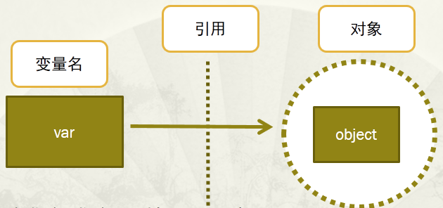
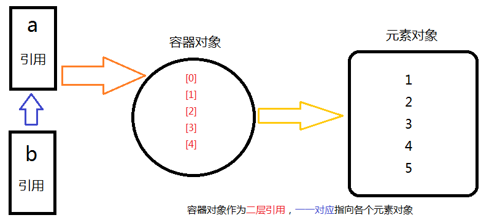
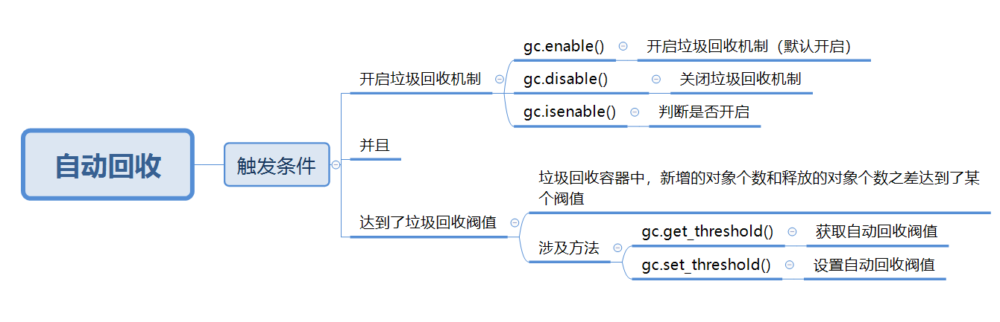

# Python内存管理机制

## 一.变量与对象



由于python中万物皆对象，所以python的存储问题是**对象的存储问题**，并且对于每个对象，python会分配一块*内存空间去存储它*

### 变量

+ 通过<mark>变量指针</mark>引用对象

+ 变量指针指向具体对象的内存空间，取对象的值


### 对象

+ 类型已知
+ 每个对象都包含一个头部信息（头部信息：**类型标识符**和**引用计数器**）


**注意：**

　　变量名没有类型，类型属于对象（因为变量引用对象，所以类型随对象），变量引用什么类型的对象，变量就是什么类型的。


```python
a = 123
b = a
print(id(a))
print(id(b))

a = 456
print(id(a))
print(id(b))
```


### 引用所指判断

通过is进行引用所指判断，is是用来判断两个引用所指的对象是否相同

**整数：**

```python
a = 1
b = 1
print(a is b)  # True
```

**短字符串：**

```python
c = "good"
d = "good"
print(c is d)  # True
```

**长字符串：**

```python
e = "very good"
f = "very good"
print(e is f)  # False
```

**列表：**

```python
g = []
h = []
print(g is h) # False
```

**由运行结果可知：**

1. Python**缓存了整数和短字符串**，因此每个对象在内存中只存有一份，引用所指对象就是相同的，即使使用赋值语句，也只是创造新的引用，而不是对象本身；
2. Python没有缓存长字符串、列表及其他对象，可以由多个相同的对象，可以使用赋值语句创建出新的对象。


## 二.引用计数机制

在Python中，每个对象都有指向该对象的引用总数---引用计数

　　查看对象的引用计数：`sys.getrefcount()`

### 普通引用

```python
import sys


a = [1, 2, 3]
print(sys.getrefcount(a))  # 2

b = 2
print(sys.getrefcount(a))  # 3
print(sys.getrefcount(b))  # 3
```

**注意：**

　　当使用某个引用作为参数，传递给`getrefcount()`时，参数实际上创建了一个临时的引用。`getrefcount()`所得到的结果，会比期望的多1。

### 容器对象

Python的一个容器对象(比如：表、词典等)，可以包含多个对象

```python
a = [1, 2, 3, 4, 5]
b = a
print(a is b)  # True
a[0] = 6
print(a)  # [6, 2, 3, 4, 5]
print(a is b)  # True
print(b)  # [6, 2, 3, 4, 5]
```



由上可见，实际上，**容器对象**，如列表、元组、字典等，存储的其它对象，仅仅<mark>是对其它对象的引用，即地址，并不是这些对象本身</mark>

### 引用计数增加

1. 对象被创建，引用计数增加`1`
2. 对象被引用，增加`1`
3. 作为容器的对象，增加`1`
4. 对象被当作参数传入函数`func(object)`，增加`2`

```python
import sys


# 对象被创建
obj = "I love Python, I want to be a good programmer!"
print(sys.getrefcount(obj) - 1)  # 3

# 被引用
m = obj
print(sys.getrefcount(obj) - 1)  # 4
p = m
print(sys.getrefcount(obj) - 1)  # 5

# 作为容器对象的一个元素
a = ["a", "b", obj]
print(sys.getrefcount(obj) - 1)  # 6


def foo(x):
    z = "Hello world! "
    print(sys.getrefcount(obj) - 1)  # 8
    print(z)


foo(obj)
print(sys.getrefcount(obj) - 1)  # 6  函数执行完毕后局部名称空间被销毁，引用计数减少
```

### 引用计数减少

1. 对象的别名被显式减少 `del obj`
2. 对象的一个别名被赋值给其它对象
3. 对象从一个容器对象中移除，或，容器对象本身被销毁
4. 一个本地引用离开了它的作用域，比如上面的foo(x)函数结束时，x指向的对象引用减1

### 引用计数器机制

**作用：**

+ 利用引用计数器方法，Python解释器在检测到<mark>对象引用个数为0时</mark>，对普通的对象进行<mark>释放内存</mark>的机制

### 关于循环引用问题

+ 循环引用即**对象之间进行相互引用**，出现循环引用后，利用上述引用计数机制无法对循环引用中的对象进行释放空间，这就是循环引用问题

+ 循环引用形式

  ```python
  import sys
  
  
  class Person(object):
      pass
  
  
  class Dog(object):
      pass
  
  
  p = Person()
  d = Dog()
  print(sys.getrefcount(p)-1, sys.getrefcount(d) - 1)  # 1, 1
  p.pet = d
  print(sys.getrefcount(d) - 1)  # 2
  d.master = p
  print(sys.getrefcount(p) - 1)  # 2
  ```

  object p中的属性引用object d， 而object d中的属性同时引用object p，从而造成仅仅删除对象d和p，无法释放内存空间，因为它们依然被引用；

  即，循环引用后，对象p和d的引用计数为2，删除对象p和d后，引用计数为1，不是0，而Python解释器只有在检查到一个对象的引用计数为0时，才能自动释放内存，所以这里无法释放p和d所占用的内存

</br>

## 垃圾回收机制

当Python中的对象越来越多，占据越来越大的内存，启动垃圾回收`garbage collection`，将没用的对象清除

**作用：**

+ 从经过引用计数器机制后还没有被释放掉内存的对象中，找到循环引用对象，并释放掉其内存

### 底层层面（原理）

**垃圾回收检测流程：**

==如何找到循环引用并释放内存：==

1. 收集所有容器对象（循环引用只针对容器对象，其它对象不会产生循环引用），使用双向链表（可以看作一个集合）对这些容器对象进行引用
2. 针对每一个容器对象，使用变量`gc_refs`来记录当前对应的引用个数
3. 针对每一个容器对象，找到其正在引用的其它容器对象，并将这个被引用的容器对象引用计数减去`1`
4. 检查所有容器对象的引用计数，若为0，则证明该容器对象是由于循环引用存活下来的，并对其进行销毁

<mark>提升查找循环引用的性能：</mark>

+ 循环引用查找和销毁过程非常繁琐，要分别处理每一个容器对象，所以python考虑一种改善性能的做法，即分代回收

+ 首先是一个假设--如果一个对象被检测了10次还没有被销毁，就减少对其的检测频率；基于这个假设，提出一套机制，即分代回收机制

**分代回收机制：**

1. 默认一个对象被创建出来后，属于0代
2. 如果经历过这一代“垃圾回收”后，依然存活，则划分为下一代
3. “垃圾回收”的周期顺序为
   1. 0代“垃圾回收”一定次数，会触发0代和1代回收
   2. 1代“垃圾回收”一定次数，会触发0代，1代和2代回收

**通过这个分代回收机制，循环引用处理过程就会得到很大的性能提升**

### 垃圾回收时机

**自动回收：**



**手动回收：**这里要使用`gc`模块中的`collect()`方法，使得执行这个方法时执行分代回收机制

```python
import objgraph, gc, sys  # objgraph模块的count()方法是记录当前类产生的实例对象的个数


class Person(object):
    pass


class Dog(object):
    pass


p = Person()
d = Dog()
print(sys.getrefcount(p) - 1, sys.getrefcount(d) - 1)  # 1, 1
p.pet = d
d.master = p
print(sys.getrefcount(p) - 1, sys.getrefcount(d) - 1)  # 2, 2
del p, d
print(objgraph.count("Person"), objgraph.count("Dog"))  # 1, 1
gc.collect()
print(objgraph.count("Person"), objgraph.count("Dog"))  # 0, 0
```

</br>

## 内存池机制

Python中有分为大内存和小内存：（256K为界限分大小内存）

1. 大内存使用malloc进行分配
2. 小内存使用内存池进行分配

Python的内存（金字塔）：

+ 第3层：**最上层**，用户对Python对象的直接操作
+ 第1层和第2层：**内存池**，由Python的接口函数`PyMem_Malloc`实现-----若请求分配的内存在1~256字节之间就使用内存池管理系统进行分配，调用`malloc`函数分配内存，但是每次只会分配一块大小为256K的大块内存，不会调用`free`函数释放内存，<mark>将该内存块留在内存池中以便下次使用</mark>
+ 第0层：**大内存**-----若请求分配的内存大于256K，`malloc`函数分配内存，`free`函数释放内存
+ 第-1，-2层：操作系统进行操作

</br>

## 总结

<mark>**python的内存管理机制就是引用计数器机制和垃圾回收机制的混合机制**</mark>

</br>

