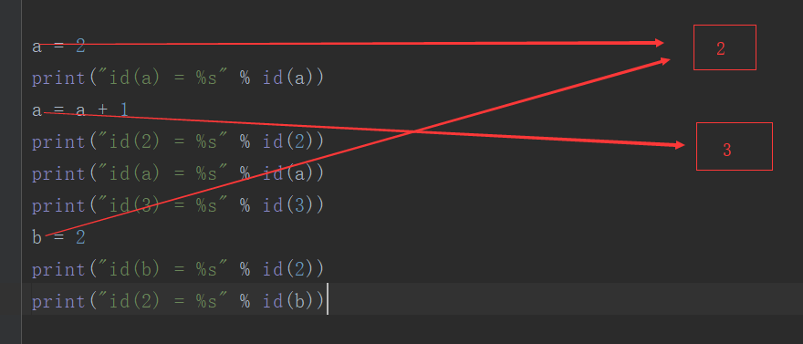
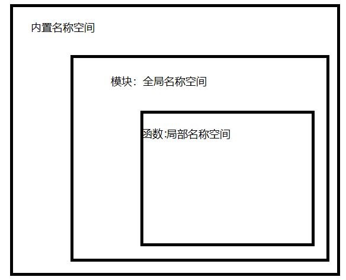

# Python名称空间与作用域

## Name

Python 的**Name（名称）**是**对象**的一个**Identifier（标识）**。在 Python 里面一切皆对象，<mark>名称就是用来引用对象的。</mark>

```python
a = 2
print(id(a))  # 1966107712
print(id(2))  # 1966107712

# 可以看到，两都均指向同一个对象
```

在`a = 2`这个语句中，`2`是个存储在内存中的一个对象，名称`a`则会引用`2`这个对象，<mark>“引用”的含义是指可以**通过名称**`a`来使用`2`这个对象</mark>。我们可以使用`id()`函数来获取对象的地址.

更为复杂的代码：

```python
a = 2
print("id(a) = %s" % id(a))  # id(a) = 1966107712
a = a + 1
print("id(2) = %s" % id(2))  # id(2) = 1966107712
print("id(a) = %s" % id(a))  # id(a) = 1966107744
print("id(3) = %s" % id(3))  # id(3) = 1966107744
b = 2
print("id(b) = %s" % id(2))  # id(b) = 1966107712
print("id(2) = %s" % id(b))  # id(2) = 1966107712
```



1. 创建对象`2`, 名称`a`引用了对象`2`
2. 执行操作`a = a + 1`，这时候对象`3`被创建，名称`a`引用了对象`3`。所以此时`id(a)`和`id(3)`指向相同内存地址相同；此时对象`2`任然存在内存中；
3. 执行操作`b = 2`,不会重复创建对象`2`（内存中已经存在对象`2`）,  名称`b`引用了对象`2`，所以`id(2)`和`id(b)`相同

Python 在执行变量的赋值时，并不会重复创建一个对象的事实。**名称采用动态绑定的机制**使得 Python 更加高效，同一个名称可以引用不同类型的对象

```python
a = 5
a = "hello world"
a = [1, 2, 3]

# a先后引用了数字，字符串，列表的类型的对象，这在 Python 中完全是合法的
# 此时a指向了对象[1, 2, 3]
```

</br>

## 名称空间

### NameSpace定义

​	<mark>名称到对象的映射</mark>，名称空间是一个**字典**的实现，**键为变量名，值是变量对应的值**。各个名称空间是独立没有关系的，一个名称空间中不能有重名，但是不同的名称空间可以重名而没有任何影响


Python解释器大致执行过程：

​	Python解释启动时，开辟一块内存空间（内置名称空间）；逐行读取解释一个模块的代码，在内存中再开辟一块内存空间（全局名称空间），每当遇到遇到一个变量的时候，就把变量名称和值（对象）之间的对应关系记录在内存中（全局名称空间），但是当遇到函数名时，解释器只会将函数名象征性地读入内存（全局名称空间）。

​	等到函数被执行时，Python解释器会再开辟一块内存（局部名称空间）来存储这个函数内部的内容（函数中的各种对象和名称的对应关系），当函数执行完毕后，局部名称空间会被回收清空。


### 分类

+ **Built-in：**内置名称空间，例如：Python 的内置函数，如，`abs()`
+ **Global：**全局名称空间（模块名称空间，在模块内定义的名称）
+ **Local：**局部名称空间，例如：在函数（function）或者类（class）被调用时，其内部包含的名称


### 生命周期

+ Built-in（内置名称空间）在python解释器启动时创建，一直保留直到解释器退出
+ Global（全局名称空间）在模块被加载时创建，通常一直保留直到python解释器退出
+ Local（局部名称空间）在函数被调用时才被创建，但函数返回结果或抛出异常时被删除。（每一个递归函数都拥有自己的名称空间）


**名空间创建顺序：**

python解释器启动 ->创建内建名称空间 -> 加载模块 -> 创建全局名称空间 ->函数被调用 ->创建局部名称空间


**名称空间销毁顺序：**

名称函数调用结束 -> 销毁函数对应的局部名称空间 -> python虚拟机（解释器）退出 ->销毁全局名称空间 ->销毁内建名称空间




</br>

## 变量的作用域

### Scope（作用域）

+ Python的一块文本区域，这个区域中，名称空间可以被“直接访问”。这里的直接访问指的是试图在名称空间中找到名字的绝对引用(非限定引用)
  + **直接引用：**直接使用名字访问的方式，如`name`，这种方式尝试在名字空间中搜索名字`name`
  + **间接引用：**使用形如`objname.attrname`的方式，即**属性引用**，这种方式不会在命名空间中搜索名字`attrname`，而是搜索名字`objname`，再访问其属性
+ 作用域是针对变量而言，指申明的变量在程序里的可应用范围。或者称为变量的可见性
+ 只有当变量在Module(模块)、Class(类)、def(函数)中定义的时候，才会有作用域的概念，代码块不会产生作用域

### 高级语言对数据类型的使用过程

一般的高级语言在使用变量时，都会有下面4个过程。

1. **声明变量：**让编译器或解释器知道有这一个变量的存在
2. **定义变量：**为不同数据类型的变量分配内存空间
3. **初始化：**赋值，填充分配好的内存空间
4. **引用：**通过引用对象(变量名)来调用内存对象(内存数据)

</br>

### 作用域分类

+ **L(local)**局部作用域

  ```python
  # 局部变量：包含在def关键字定义的语句块中，即在函数中定义的变量。每当函数被调用时都会创建一个新的局部作用域。Python中也有递归，即自己调用自己，每次调用都会创建一个新的局部命名空间。在函数内部的变量声明，除非特别的声明为全局变量，否则均默认为局部变量。有些情况需要在函数内部定义全局变量，这时可以使用global关键字来声明变量的作用域为全局。局部变量域就像一个 栈，仅仅是暂时的存在，依赖创建该局部作用域的函数是否处于活动的状态。所以，一般建议尽量少定义全局变量，因为全局变量在模块文件运行的过程中会一直存在，占用内存空间。
  # 注意：如果需要在函数内部对全局变量赋值，需要在函数内部通过global语句声明该变量为全局变量。
  ```

+ **E(enclosing)**嵌套作用域

  ```python
  # E也包含在def关键字中，E和L是相对的，E相对于更上层的函数而言也是L。与L的区别在于，对一个函数而言，L是定义在此函数内部的局部作用域，而E是定义在此函数的上一层父级函数的局部作用域。主要是为了实现Python的闭包，而增加的实现。
  ```

+ **G(global)**全局作用域

  ```python
  # 即在模块层次中定义的变量，每一个模块都是一个全局作用域。也就是说，在模块文件顶层声明的变量具有全局作用域，从外部开来，模块的全局变量就是一个模块对象的属性。
  
  # 注意：全局作用域的作用范围仅限于单个模块文件内
  ```

+ **B(built-in)**内置作用域

  ```python
  # 系统内固定模块里定义的变量，如预定义在builtin 模块内的变量。
  ```

  

### LEGB法则

**搜索变量名的优先级：**L(局部作用域 )>E( 嵌套作用域) >G( 全局作用域) >B( 内置作用域)

**LEGB法则**： 
当在函数中使用未确定的变量名时，Python会按照优先级依次搜索4个作用域，以此来确定该变量名的意义。首先搜索局部作用域(L)，之后是上一层嵌套结构中def或lambda函数的嵌套作用域(E)，之后是全局作用域(G)，最后是内置作用域(B)。按这个查找原则，在第一处找到的地方停止。如果没有找到，则会出发NameError错误。


### 与名称空间的关系

现在，名称空间持有了名字。作用域是Python的一块文本区域，即一块代码区域，需要代码区域引用名字(访问变量)，那么必然作用域与名称空间之间就有了联系。

顾名思义，名字作用域就是名字可以影响到的代码文本区域，名称空间的作用域就是这个命名空间可以影响到的代码文本区域。那么也存在这样一个代码文本区域，多个名称空间可以影响到它。
 作用域只是文本区域，其定义是静态的；而名字空间却是动态的，只有随着解释器的执行，名称空间才会产生。那么，在静态的作用域中访问动态名称空间中的名字，造成了作用域使用的动态性。

那么，可以这样认为：

<mark>**静态的作用域，是一个或多个名称空间按照一定规则叠加影响代码区域**</mark>

<mark>**运行时动态的作用域，是按照特定层次组合起来的命名空间。**</mark>

在一定程度上，可以认为**动态的作用域就是名称空间**。在后面的表述中，我会把动态的作用域与其对应命名空间等同起来。

### 作用域应用

#### free variable

free variable的定义：

```python
If a variable is used in a code block but not defined there, it is a free variable.
```

我们已经了解了作用域有**LEGB**的层次，并按顺序搜索名字。按照搜索顺序，当**低层作用域不存在**待搜索名字时，**引用高层作用域存在的名字**，也就**free variable(自由变量)**

**example_1:**

```python
def low_scope():
    print(s)  # L层不存在s，引用G层名字s
    

s = 'upper scope'
low_scope()
```

**example_2:**

```python
def low_scope():
    s = "lower scope"  # 在局部作用域定义s


s = "upper scope"  # 全局作用域定义s
low_scope()
print(s)  # upper scope

"""
A special quirk of Python is that – if no global statement is in effect – assignments to names always go into the innermost scope.
"""
```

即赋值语句影响局部作用域，<mark>赋值语句带来的影响是绑定或重绑定</mark>，但是在当前局部作用域的命名空间中，并没有s这个名字，因此赋值语句在局部作用于定义了同名名字s，这与外层作用域中的s并不冲突，因为它们分属不同名称空间。
这样，全局作用域的s没有被重绑定，结果就很好解释了

**example_3:**

```python
def low_scope():
    lst[0] = 2


lst = [1, 2]
low_scope()
print(lst)  # [2, 2]
```

当涉及可变对象时，情况又有所不同了, `lst[0] = 2`并不是对名字l的重绑定，而是对l的第一个元素的重绑定，**所以没有新的名字被定义**。因此在函数中成功更新了全局作用于中l所引用对象的值

与**example_4**进行对比

**example_4:**

```python
def low_scope():
    lst = [2, 2]
    

lst = [1, 2]
low_scope()
print(lst)  # [1, 2]
```

综上，可以认为：

**自由变量可读不可写**

#### global和nonlocal

总是存在打破规则的需求：

在低层作用域中需要重绑定高层作用域名字，即通过自由名字重绑定于是global语句和nonlocal语句因运而生。

​	**global语句**是适用于当前代码块的声明语句。列出的标识符被解释为全局名字。虽然自由名字可以不被声明为global就能引用全局名字，但是不使用global关键字绑定全局名字是不可能的。

​	**nonlocal语句**使得列出的名字指向最近封闭函数中绑定的名字，而不是全局名字。默认的绑定行为会首先搜索局部作用域。nonlocal语句使得在内层函数中重绑定外层函数作用域中的名字成为可能，即使同名的名字存在于全局作用域。

**官方案例：**

```python
def scope_test():

    def do_local():
        spam = "local spam"

    def do_nonlocal():
        nonlocal spam  # 当外层作用域不存在spam名字时，nonlocal不能像global那样自作主张定义一个
        spam = "nonlocal spam"  # free variable spam经nonlocal声明后，可以做重绑定操作了，可写的。

    def do_global():
        global spam  # 即使全局作用域中没有名字spam的定义，这个语句也能在全局作用域定义名字spam
        spam = "global spam"  # 自有变量spam经global声明后，可以做重绑定操作了，可写的。

    spam = "test spam"
    do_local()
    print("After local assignment:", spam)
    do_nonlocal()
    print("After nonlocal assignment:", spam)
    do_global()
    print("After global assignment:", spam)


scope_test()
print("In global scope:", spam)


# After local assignment: test spam
# After nonlocal assignment: nonlocal spam
# After global assignment: nonlocal spam
# In global scope: global spam
```


#### 一些坑

**example_1:**

```python
def func():
    variable = 300
    print(variable)


variable = 100
func()
print(variable)
```

**example_2:**

```python
variable = 300


def test_scope():
    print(variable)
    variable = 200


test_scope()
print(variable)

# UnboundLocalError: local variable 'variable' referenced before assignment
```

**example_2**会报出错误，因为在执行程序时的预编译能够在`test_scope()`中找到局部变量`variable`(对`variable`进行了赋值)。在局部作用域找到了变量名，所以不会升级到嵌套作用域去寻找。但是在使用print语句将变量`variable`打印时，<mark>局部变量`variable`并有没**绑定**到一个**内存对象**(没有定义和初始化，即没有赋值)</mark>。本质上还是Python**调用变量**时遵循的**LEGB**法则和**Python解析器的编译原理**，决定了这个错误的发生。所以，<mark>在调用一个变量之前，需要为该变量赋值(绑定一个内存对象)。</mark>

**Python解释器编译原理：**

<mark>Python中的模块代码在执行之前，并不会经过预编译，但是模块内的函数体代码在运行前会经过预编译，因此不管变量名的绑定发生在作用域的那个位置，都能被编译器知道。Python虽然是一个静态作用域语言，但变量名查找是动态发生的，直到在程序运行时，才会发现作用域方面的问题</mark>