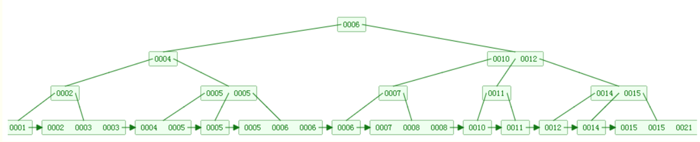
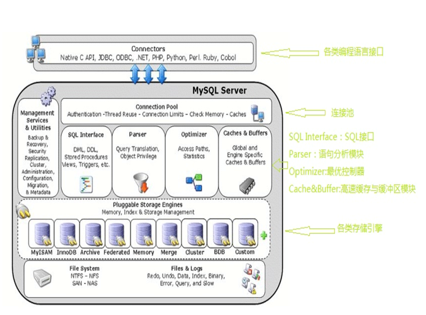
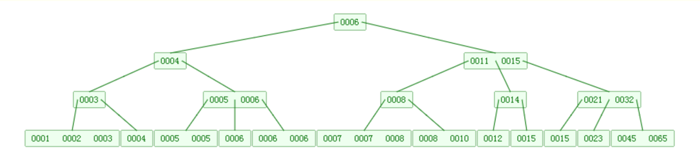
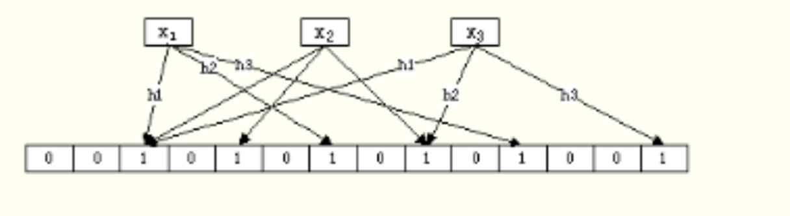
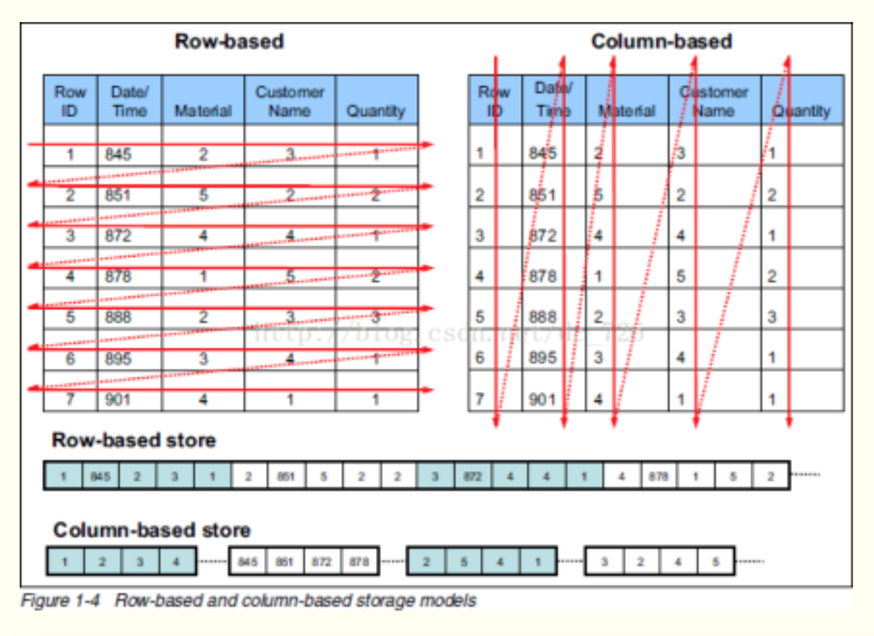

# Python面试综合--DB相关

**关系型数据库：**MySQL,Oracle,Postgrel, MariaDB, SQL Server等

+ 优点
  + 易用性：都是使用表结构，格式一致，支持sql语言
  + 支持复杂查询：多表连表查询
+ 缺点
  + 读写性能较差，海量数据时瓶颈出现
  + 灵活度不高
  + 高并发情况下硬盘IO出现瓶颈

**非关系型数据库（Not Only SQL):**Redis,Memcached, MongoDB, Hbase等

+ 优点
  + 格式灵活
  + 扩展性高
  + 速度快
  + 成本低

 

## MySQL

### 存储引擎

[详见：](https://www.cnblogs.com/pankypan/p/11106034.html)

+ MyISAM
+ InnoDB
+ Merge
+ Memory

### 索引

[详见：](https://www.cnblogs.com/Eva-J/articles/10126413.html)

+ 聚集索引
+ 非聚集索引
+ 普通索引
+ 唯一索引
+ 组合索引

#### 索引存储原理

B+树结构如下：

### 版本变迁及特性

**Mysql5.7新变化特性有：**

+  灵活性上开始支持json串格式字段
+ generated column. 即数据库中的这一列由其他列计算而得。例如，知道直角三角形的两条直角边，要求直角三角形的面积。
+ 性能提升：自动检测只读事务, 支持并行复制(slave-parallel-type)

**Mysql 8.0变化特性有:**

+ mysql8开始支持文档存储。开发人员可以将无模式 JSON 文档集合与关系表放在一起使用(文档是一堆键值对的集合，表现为 JSON 结构)
+ 性能大幅提升。速度比5.7快两倍，在读写工作负载、IO密集型工作负载、高竞争工作负载
+ 默认字符编码改为了utf8mb4

### 事务及事务隔离

RU（readuncommited）未提交读;  缺陷：不可重复读现象

RC(read commited) 提交读;  缺陷：脏读

RR(repeatable read) 可重复读;  缺陷：虚读/幻读

[详见：](https://www.cnblogs.com/pankypan/p/11078913.html)

### MVCC

MVCC (多版本并发控制)

**基本原理：**某个时间点快照

+ 每行数据都存在一个版本，每次数据更新时都更新该版本
+ 修改时Copy出当前版本随意修改，各个事务之间无干扰
+ 保存时比较版本号，如果成功（commit），则覆盖原记录；失败则放弃copy（rollback）

InnoDB 中MVCC是如何实现的？

+ 创建时版本号
+ 删除时版本号
+ 事务版本号

MVCC适用场景：RC、RR

MySQL中MVCC 特性：写锁存在，只利用其中的读非阻塞

[详见：](https://www.cnblogs.com/pankypan/p/11078913.html)

 

## 示例面试（1）

**问题：**知道mysql的事务隔离吗？/事务隔离分哪几个级别？/事务隔离性怎么保证/...

**回答思路：**

+ 空间线
  + ACID
  + 事务隔离的四个级别（概念及优缺点）
  + MySQL事务隔离性和其他DB区别

**思路串联：**

<mark>事务ACID-->事务隔离级别及分析-->MySQL事务隔离特性（留MVCC和GapLock引子）</mark>

**示例答案：**

数据库支持事务本身需要有具备四个特性：原子性、一致性、隔离性和持久性，也即**ACID**。其中事务的**隔离性简单来说就是并发执行的多个事务之间互不干扰**。

​    事务隔离总体分为四个级别：第一个是**RU(未提交读)**，该级别事务内容易出现脏读的情况，即事务A读到了事务B没有提交的数据；为了解决脏读问题，可以提高事务隔离级别到**RC(提交读)**，此时事务A不会读到其他事务未提交的数据，但又产生了一个新的现象：事务A执行的过程中，有可能另外一个事务B提交了数据，此时事务读取的数据和之前不一致，即出现了不可重复读的问题；<mark>所以mysql的InnoDB本身默认采用了第三个事务隔离级别**RR(可重复读)**，该级别使用**MVCC(多版本并发控制)**解决重复读的问题</mark>，一般的RR级别会出现幻读的问题，及同一个事务多次执行同一个select，读取到的数据行发生了改变，这是因为数据行发生了行数减少或者新增；而最高的事务隔离级别是SE(可序列化)，该方式下事务相当于串行执行，解决了脏读、不可重复读、幻读等问题，但对性能和效率的影响很大，生产环境中很少会使用该隔离级别；

​     具体到mysql中，<mark>mysql默认的RR级别有一些特别，因为其引入了GAP LOCK(间隙锁)的概念，可在RR级别即可解决幻读的问题；另外一个特性是mysql里的MVCC只解决读-写的阻塞问题，写-写依然还是阻塞的。</mark>

 

## MongoDB

### 存储引擎

+ MMAP
+ WiredTiger
+ RocksDB
+ Memory

**WiredTiger:**

   3.2版本默认存储引擎都改为了wiredtiger

**特性：**

+ 文档级别锁，解决了锁粒度过大的问题
+ 磁盘数据压缩
+ 删除数据时，数据会立即删除
+ MongoDB3.0在多线程、批量插入场景下较之于MongoDB2.6有大约4-7倍的增长  

**Rocksdb:**

**特性：**

+ 顺序写入：LSM Tree结构，随机写入转换为顺序写入
+ 速度稳定：和WiredTiger相比，写速度稳定

### 版本变迁及特性

**MongoDB 3.0特性（2015年）：**

**特性：**

+ 顺序写入：LSM Tree结构，随机写入转换为顺序写入
+ 速度稳定：和WiredTiger相比，写速度稳定
+ 顺序写入：LSM Tree结构，随机写入转换为顺序写入
+ 速度稳定：和WiredTiger相比，写速度稳定

**MongoDB 4.0特性（2018年6月）：**

**特性：**

+ 多文档事务支持
+ 4.2版本开始支持分片集群分布式事务

### 底层存储机制

**空间局部性原理**

**B树：**

+ 尽可能少减少磁盘IO
+ 查询性能快（O(1) --O(LogN)）

B树(4阶)结构如下：

### 和MySQL对比

**海量数据读写**，**频次**高 -- **MongoDB**

**关系型结构较多**，应用场景**事务**要求高 -- **MySQL**

其他：成本、意愿、技术栈

### 集群及发展

常见的扩展方法：

a. 水平扩展：分库，分collection

b. 垂直扩展：分片（类似于mysql中分区）

 

## Redis

[详见：](https://www.cnblogs.com/tiger666/articles/10351613.html)

### 存储类型

+ string
+ list
+ set
+ zset
+ hash

### 使用场景

+ 缓存高频次访问的数据，降低数据库io
+ 分布式架构，做session共享
+ 利用zset类型可以存储排行榜
+ 利用list做简易MQ或存储最新的n个数据

### 存储机制

+ list键：双向链表
+ hash键：字典dict
+ zset键：跳跃表zskiplist
+ ziplist:节省内存空间

###  集群

+ Twitter开发的twemproxy
+ 豌豆荚开发的codis
+ redis官方的redis-cluster

### Bloom

Bloom Filter算法：

对于有n个元素的集合S={x1, x2,……,xn}，我们用k个哈希函数(h1,h2,……,hn)，分别将S中的每一个元素映射到一个m位的位数组(bm-1bm-2……b1b0)中。该位数组在初始化时所有置为0，每当用哈希函数映射到该位时则将该位置为1。对于已经置为1的位则不在反复置1。

如下图展示x1,x2, x3的插入过程：

 **查找时性能：**

+ 线性结构： O(N)
+ 二叉树：O(logN)
+ Bloom：O(1)

 

## 列式数据库

OLTP（on-line transaction processing ）: 联机事务处理 

OLAP（on-line Analytical Processing）：联机分析处理

交易性数据库：oracle、sqlserver、mysql

分析性数据库：hbase、hive、clickhouse

### 数据库仓库

**一般使用列式数据库：**

+ 数据来源多个系统
+ 多维度统计数据
+ 更新数据少
+  ...

### 行式和列式对比

**行存储：**数据存储一行接一行；

**列存储：**一列的所有数据放一起；

 

## 示例面试（2）

**问题：**MySQL和MongoDB区别？

**思路：**

+ 时间线
  + 2015年，MySQL5.7发布，开始支持json
  + 2018年，MySQL8.0版本，支持文档存储
  + 2018年，MongoDB4.0发布，支持多文档事务
+ 空间线
  + MySQL存储引擎及底层存储B+树
  + Mongodb存储引擎及底层存储B树
  +  DB选型考虑因素

**思路串联：**

<mark>MySQL存储引擎及结构介绍--MongoDB存储引擎及结构介绍-->MySQL和MongoDB区别（夹杂时间线）--> DB选型因素--> 埋下一个问题引子（事务相关）</mark> 

**示例答案：**

​	MySQL是关系型数据库的一种，其存储引擎有MyISam, InnoDB，Merge等，目前在业界中大多使用的支持事务InnoDB存储引擎，从15年MySQL5.7开始，MySQL开始支持json格式（开始向nosql数据库靠近）；而MongoDB去年8月份发布的最新版本4.0开始支持多文档事务，当前其默认的存储引擎wiredtiger性能非常卓越；

​       mysql和MongoDB数据库发展越来越类似，都在取其精华，在具体的数据库选型时，两种DB底层的实现机制可能是一大考虑因素。mysql索引底层是用B+树实现的，而MongoDB则是采取的B树，B树的结构也就决定了MongoDB在海量读写的情况下性能比mysql卓越（时间复杂度是O(1)-O(logN)）, 而MySQL B+树的特性也决定了MySQL更适合多区间范围查询的业务需求。

​       当然，在具体的项目DB选择过程中，我们还需要考虑到成本、团队成员的意愿、技术栈等情况。总的来说，在当前的情况下，如果是海量数据高并发读写，从技术的角度推荐使用MongoDB，如果数据结构相对统一，同时对于事务有较高要求，个人倾向于MySQL。

