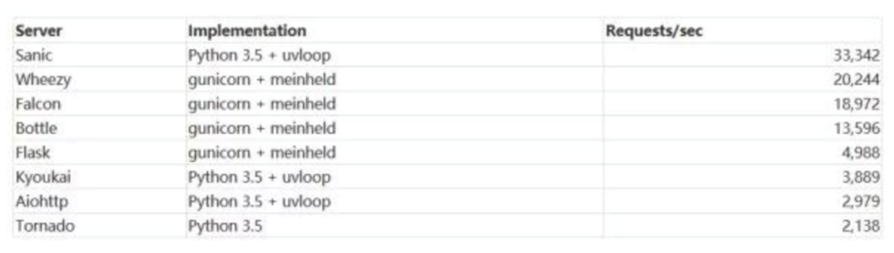

# Python面试综合--web相关

## websocket

[详见：](https://www.cnblogs.com/pankypan/p/11156459.html)

### ajax和poll

+ ajax轮询
  + 浏览器每隔几秒就发送一次请求，询问服务器是否有新信息
+ long poll
  + 轮询
  + 阻塞：一直打电话，没收到就不挂电话

------

**ajax和long poll缺点：**

+ 服务端被动式
+ ajax要求服务端很快的处理速度
+ long poll要求服务端高并发

------

### websocket与http

+ http：无状态协议---健忘鬼
+ websocket：
  + 服务端可以主动推送消息到客户端
  + 持久性：一次请求，持续消息传递（回调）

 

## IO多路复用

[详见：](https://blog.csdn.net/sehanlingfeng/article/details/78920423)

### IO多路复用定义

场景一：

​    当我们要编写一个echo服务器程序的时候，需要对用户从标准输入键入的交互命令做出响应。在这种情况下，服务器必须响应两个相互独立的I/O事件：

1. 网络客户端发送网络连接请求
2. 用户在键盘上键入命令行　

IO多路复用：**很多个网络I/O复用一个或少量的线程来处理这些连接。**

### IO多路复用三种机制

[详见：](https://www.jianshu.com/p/397449cadc9a)

#### select

**1983年select出现：**

+ 轮询
+ 1024个连接上限
+ 会修改传入的参数数组
+ 非线程安全

#### poll

**1997年出现（因为长时间内select满足应用需求）：**

+ 轮询
+ 去掉了1024个上限
+ 不再修改传入的参数数组
+ 非线程安全

#### epoll

**2002年epoll产生：**

+ 事件触发：水平触发、边缘触发
+ 线程安全
+ Linux独有，BSD中为kqueue

### IO多路复用面试题

**面试题一：什么是IO多路复用？/epoll和select,poll有什么区别？**

**回答思路：**

+ 时间线：
  + 1983年，select出现
  + 1997年，poll出现
  + 2002年，epoll出现
+ 空间线：
  +  多路复用概念
  + select、poll、epoll区别
  + select、poll、epoll适用场景
  + epoll和协程

**思路串联：多路复用概念--> 多用复用发展历史及使用场景（select->poll->epoll）--> 留下一个问题引子（协程）**

**示例答案：**

I/O多路复用，I/O就是指的我们**网络I/O**,**多路指多个TCP连接(或多个Channel)**，复用指**复用一个或少量线程**。

第一次实现IO多路复用的概念是在1983年select机制的出现，在很长的时间内select都满足多路复用的各类需求，但随着技术和社会的发展，select本身1024个连接上限逐渐开始不够用了，于是在1997年poll机制应运而生，poll机制去掉了select的很多问题，比如1024链接数限制，但同时本身也存在着select一样的非线程安全缺陷，同时轮询的方式在很多场景下会造成性能和资源的浪费。2002年时，一种新的多用复用机制epoll随之产生，epoll采用的是事件触发的机制，放弃了select和poll轮询的实现方式，同时又是线程安全的，大大提高了实际场景中的并发处理能力；但epoll目前也存在一些不足的地方，比如只有Linux系统才支持，同时在一些特定的场景下，比如绝大部分TCP链接都处于就绪的状态，此时比较适合轮询的方式。

总体而言，目前多路复用技术中epoll相对使用的较为广泛，比如在Python中tornado的协程很多时候就是通过epoll机制进行切换调度的。

 

## web框架

### 重要概念

+ **同步：**执行一个操作之后，等待结果，然后才继续执行后续的操作
+ **异步：**执行一个操作后，可以去执行其他的操作，然后等待通知再回来执行刚才没执行完的操作
+ **阻塞：**进程给CPU传达一个任务之后，一直等待CPU处理完成，然后才执行后面的操作
+ **非阻塞：**进程给CPU传达任我后，继续处理后续的操作，隔断时间再来询问之前的操作是否完成。这样的过程其实也叫轮询

**同步和异步：** 针对应用程序来，关注的是**程序之间的协作关系**

**阻塞与非阻塞：**关注的是**单个进程的执行状态**

**example：**

老张爱喝茶，废话不说，煮开水。

出场人物：老张，水壶两把（普通水壶，简称水壶；会响的水壶，简称响水壶）。

1. 老张把水壶放到火上，立等水开。（同步阻塞）

   老张觉得自己有点傻

2. 老张把水壶放到火上，去客厅看电视，时不时去厨房看看水开没有。（同步非阻塞）

   老张还是觉得自己有点傻，于是变高端了，买了把会响笛的那种水壶。水开之后，能大声发出嘀~~~~的噪音。

3. 老张把响水壶放到火上，立等水开。（异步阻塞）

   老张觉得这样傻等意义不大

4. 老张把响水壶放到火上，去客厅看电视，水壶响之前不再去看它了，响了再去拿壶。（异步非阻塞）

   老张觉得自己聪明了。

### Django

[详见：](https://www.cnblogs.com/Michael--chen/p/10495057.html)

+ 大而全
+ 全自动化的管理后台
+ 高耦合：ORM和其它模块

### Flask

+ 小而精（microframework）
+ 核心简单，extension增加其它功能

### Tornado

+ 少而精
+ 高性能
+ 异步非阻塞
+ 更为原始，插件少

### Sanic

+ Python3.5+
+ 异步
+ 速度快
+ 类flask

 

### web框架面试题

**了解过tornado或sanic吗？/有木有接触过其他web框架...？**

**思路：**

+ 空间线
  + django设计哲学
  + flask、tornado、sanic特性
  + 同步和异步
  + 阻塞和非阻塞
  + 项目框架选型

**思路串联：**各框架特性--同步异步、框架选型-->埋下一个问题引子（协程）

**示例答案：**

有了解过tornado和sanic框架，不过之前公司的项目中大多框架选用的是django，少部分项目使用的flask。其中django设计哲学是简便、快速，强调代码复用，大而全是代表特性，而flask相对而言小而精一点。**tornado和sanic是异步框架，性能都非常卓越**，tornado是Facebook开源的一个项目，目前应用亦颇为广泛；sanic是基于Python3.5的近些年兴起的框架，用到了很多Python3的新特性。

一般在框架选型过程中，如果希望开发过程中框架有丰富的三方插件，推荐<u>使用django和flask，然后部署时使用NGINX+uwsgi提高并发</u>；如果纯粹的后端项目，更加追求性能，可以考虑使用tornado或者sanic等异步框架，像tornado、sanic这些支持协程的框架确实比较适合大多数的高并发网络IO处理。

 

