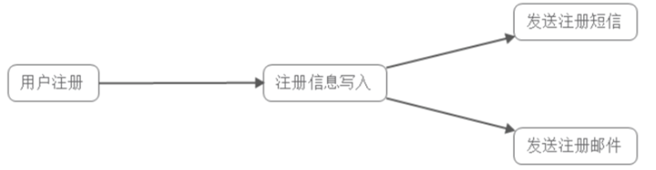
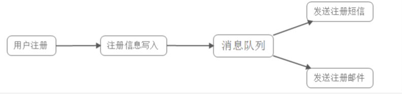
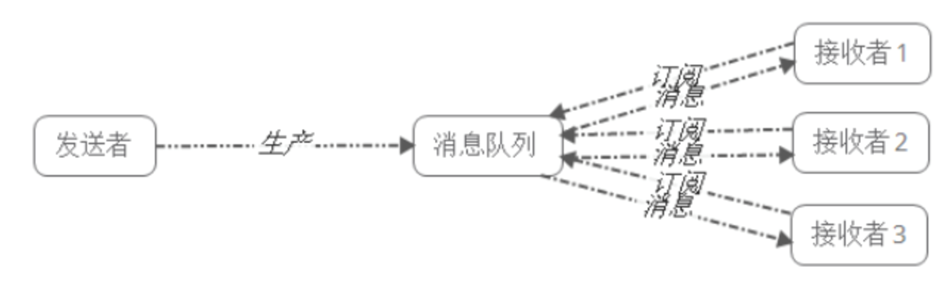
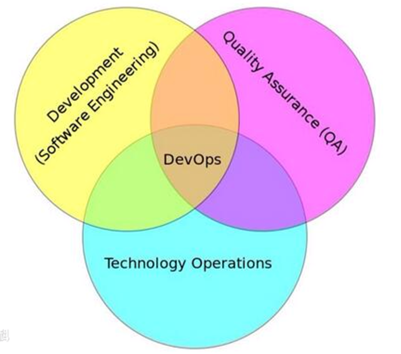
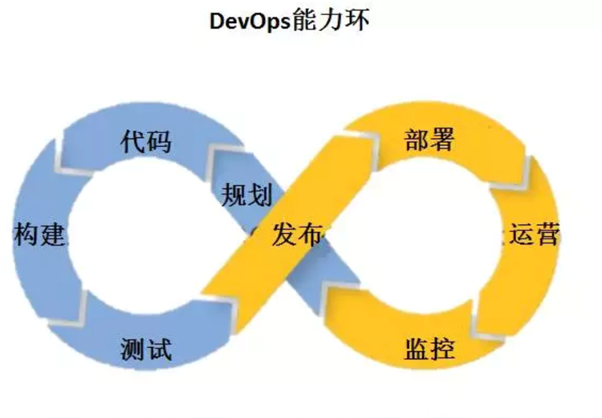
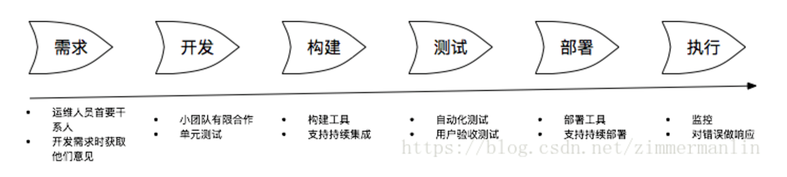

# Python面试综合--MQ和DevOps

## MQ(消息队列)

什么时候需要用消息队列？

-- 当**不需要立即获得结果**，但是**并发量又需要进行控制**的时候，差不多就是需要使用消息队列的时候。

### 使用场景

+ **应用耦合：**多应用间通过消息队列对同一消息进行处理，避免调用接口失败导致整个过程失败
+ **异步处理：**多应用对消息队列中同一消息进行处理，应用间并发处理消息，相比串行处理，减少处理时间
+ **限流削峰：**广泛应用于秒杀或抢购活动中，避免流量过大导致应用系统挂掉的情况
+ **消息驱动的系统：**系统分为消息队列、消息生产者、消息消费者，生产者负责产生消息，消费者(可能有多个)负责对消息进行处理

#### 应用耦合

场景：上传图片后人脸识别

传统方式：图片上传系统--------调用接口--------> 人脸识别系统

**缺陷：**

+ 人脸识别系统失败则图片上传也失败
+ 延迟高
+ 图片系统和人脸系统接口互相耦合

**消息队列方式：**

图片上传系统-----生产---->消息队列<----消费---人脸识别系统

#### 异步调用

场景：用户为了使用某个应用，进行注册，系统需要发送注册邮件并验证短信    

**传统并行方式：**

**消息队列方式：**

#### 限流削峰

场景：购物优惠活动，如双十一。由于瞬时访问量过大，服务器接收过大，会导致流量暴增，相关系统无法处理请求甚至崩溃。

**消息队列优势：**

+ 请求先入消息队列，而不是由业务处理系统直接处理，做了一次缓冲,极大地减少了业务处理系统的压力
+ 队列长度可以做限制，事实上，秒杀时，后入队列的用户无法秒杀到商品，这些请求可以直接被抛弃，返回活动已结束或商品已售完信息

#### 消息队列驱动系统

**场景：**

1. 用户新上传了一批照片
2. 人脸识别系统需要对这个用户的所有照片进行聚类
3. 聚类完成后由对账系统重新生成用户的人脸索引(加快查询)

这三个子系统间由消息队列连接起来，前一个阶段的处理结果放入队列中，后一个阶段从队列中获取消息继续处理。

**优势：**

+ 避免了直接调用下一个系统导致当前系统失败
+ 每个子系统对于消息的处理方式可以更为灵活，可以选择收到消息时就处理，可以选择定时处理，也可以划分时间段按不同处理速度处理

### 两种模式

**点对点模式：**

+ 单个接收者
+ 无依赖
+ 接收者需要应答

**发布订阅模式：**

+ 多个订阅者
+ 时间上的依赖性。创建一个订阅者之后，才能消费发布者的消息
+ 提前订阅该角色主题，并保持在线运行

### RabbitMQ

2007年发布，高性能MQ,最主流的消息中间件之一

**优点：**

1. 性能好，并发高，单机QPS在万数量级别
2. 可靠性高，有消息确认机制和持久化机制
3. 可定制路由
4. 社区活跃，管理界面丰富

**缺陷：**

1. 不利于二次开发和维护（erlang语言）
2. 接口和协议较复杂，学习成本高

**RabbitMQ注意事项：**

1. RabbitMQ的消息应当尽可能的小，并且只用来处理实时且要高可靠性的消息
2. 消费者和生产者的能力尽量对等，否则消息堆积会严重影响RabbitMQ的性能
3. 集群部署，使用热备，保证消息的可靠性

### Kafka

**优点：**

1. 客户端语言丰富
2. 性能极佳，单机QPS百万级别
3. 分布式架构，拥有高可用性和可靠性，理论消息存储无上限
4. 消费者采用Pull方式获取消息, 消息有序, 通过控制能够保证所有消息被消费且仅被消费一次
5. 有优秀的第三方Kafka Web管理界面Kafka-Manager
6. 在日志领域比较成熟，被多家公司和多个开源项目使用
7. 支持批量操作

**缺点：**

1. 目前支持的功能没有RabbitMQ丰富
2. 消息传递只支持pull模式，不支持push
3. 一台代理宕机后，消息会发生乱序

**Kafka注意事项：**

1. 应当有一个非常好的运维监控系统，不单单要监控Kafka本身，还要监控Zookeeper
2. 对消息顺序不依赖，且不是那么实时的系统
3. 对消息丢失并不那么敏感的系统

 

## DevOps

什么是DevOps?

**DevOps（Development和Operations的组合词）**是一组过程、方法与系统的统称, 用于促进开发（应用程序/软件工程）、技术运营和质量保障（QA）部门之间的沟通、协作与整合。

DevOps希望做到的是软件产品交付过程中IT工具链的打通，使得各个团队减少时间损耗，更加高效地**协同工作**。

### 软件开发阶段

+ 瀑布式开发
+ 敏捷式开发
+ DevOps：DevOps是一套实践方法，在保证高质量的前提下，缩短系统变更从提交到部署至生产环境的时间

**最佳实践：**

### 常用技术

**敏捷管理工具：**

+ Trello
+ Teambition
+ Worktile
+ Tower

**代码仓库管理：**

+ Git
+ Gitlab
+ Github

**虚拟机与容器化：**

+ VMware
+ VirtualBox
+ Docker

**持续集成（CI）和持续部署（CD）：**

+ Jenkins：自动化部署上线
+ Hudson
+ Travis CI
+ CircleCI

**自动化运维工具：**

+ Ansible
+ Puppet
+ Chef

**监控管理工具：**

+ Zabbix
  + Zabbix是一个基于WEB界面的提供分布式系统监视以及网络监视功能的企业级开源解决方案
+ ELK Stack日子分析系统
  + ELK Stack是开源日志处理平台解决方案，背后的商业公司是Elastic。它由日志采集解析工具 Logstash、基于 Lucene 的全文搜索引擎Elasticsearch、分析可视化平台 Kibana三部分组成

 