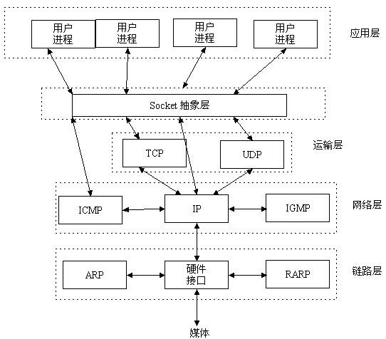
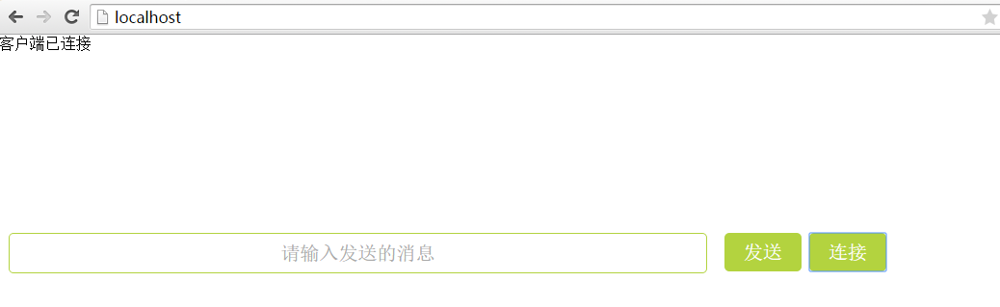
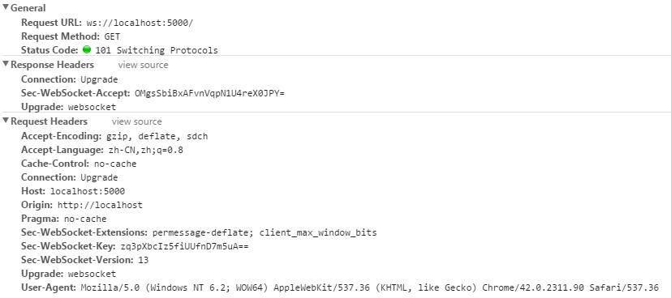
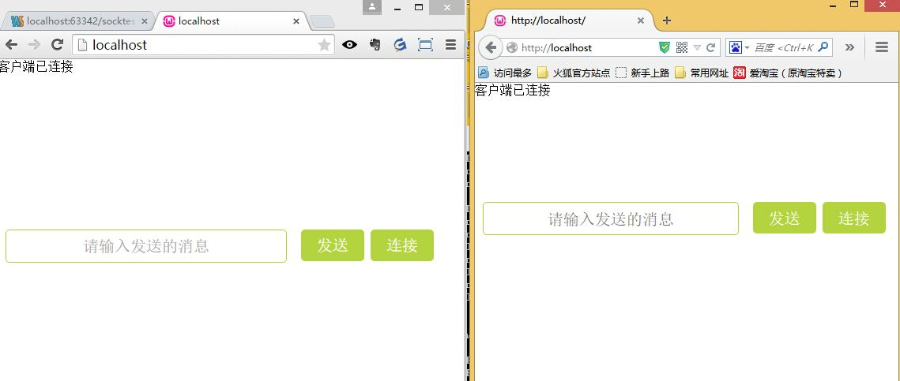
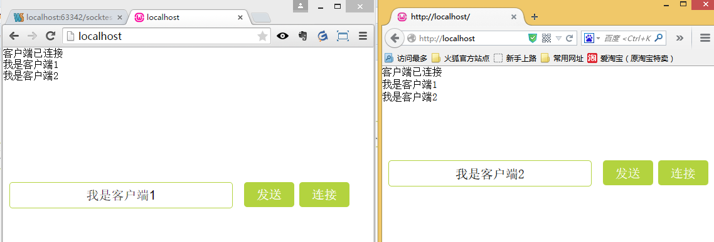

# Socket与Websocket初识

## 引子

我们知道，在网络中的**两个应用程序（进程）需要全双工相互通信（全双工即双方可同时向对方发送消息），需要用到的就是socket，它能够提供端对端通信**，对于程序员来讲，他只需要在某个应用程序的一端（暂且称之为客户端）创建一个socket实例并且提供它所要连接一端（暂且称之为服务端）的IP地址和端口，而另外一端（服务端）创建另一个socket并绑定本地端口进行监听，然后客户端进行连接服务端，服务端接受连接之后双方建立了一个端对端的TCP连接，在该连接上就可以双向通讯了，而且一旦建立这个连接之后，通信双方就没有客户端服务端之分了，提供的就是端对端通信了。我们可以采取这种方式构建一个桌面版的im程序，让不同主机上的用户发送消息。**从本质上来说，socket并不是一个新的协议，它只是为了便于程序员进行网络编程而对tcp/ip协议族通信机制的一种封装**

**websocket**是html5规范中的一个部分，它*借鉴了socket这种思想*，**为web应用程序客户端和服务端之间（注意是客户端服务端）提供了一种全双工通信机制。**同时，它又是**一种新的应用层协议**，[websocket协议](http://datatracker.ietf.org/doc/rfc6455/?include_text=1)是为了提供web应用程序和服务端全双工通信而专门制定的一种应用层协议，通常它表示为：`ws://echo.websocket.org/?encoding=text  HTTP/1.1`，可以看到除了前面的协议名和http不同之外，它的表示地址就是传统的url地址。可以看到，websocket并不是简单地将socket这一概念在浏览器环境中的移植

</br>

## Socket



**Socket是应用层与TCP/IP协议族通信的中间软件抽象层，它是一组接口。**在设计模式中，Socket其实就是一个门面模式，它把复杂的TCP/IP协议族隐藏在Socket接口后面，对用户来说，<mark>一组简单的接口就是全部，让Socket去组织数据，以符合指定的协议。</mark>

其实站在你的角度上看，socket就是一个模块。我们通过调用模块中已经实现的方法*建立两个进程之间的连接和通信。*
也有人将socket说成`ip+port`，因为`ip`是用来标识互联网中的一台主机的位置，而port是用来标识这台机器上的一个应用程序。
所以我们只要确立了ip和port就能找到一个应用程序，并且使用socket模块来与之通信。

### Socket发展史

套接字起源于 20 世纪 70 年代加利福尼亚大学伯克利分校版本的 Unix,即人们所说的 BSD Unix。 因此,有时人们也把套接字称为“伯克利套接字”或“BSD 套接字”。一开始,套接字被设计用在同 *一台主机上多个应用程序之间的通讯*。这也被称进程间通讯,或 IPC。<mark>套接字有两种（或者称为有两个种族）,分别是基于文件型的和基于网络型的。 </mark>

#### 基于文件类型的socket家族

套接字家族的名字：**AF_UNIX**

unix一切皆文件，基于文件的套接字调用的就是**底层的文件系统来取数据**，两个套接字进程运行在同一机器，可以**通过访问同一个文件系统间接完成通信**

#### 基于网络类型的socket家族

套接字家族的名字：**AF_INET**

还有AF_INET6被用于ipv6，还有一些其他的地址家族，不过，他们要么是只用于某个平台，要么就是已经被废弃，或者是很少被使用，或者是根本没有实现，所有地址家族中，AF_INET是使用最广泛的一个，python支持很多种地址家族，但是由于我们只关心网络编程，所以大部分时候我么只使用AF_INET

</br>

## websocket

### 通信原理和机制

首先Websocket是基于HTTP协议的，或者说**借用**了HTTP的协议来完成一部分握手。
在握手阶段是一样的

------

首先我们来看个典型的Websocket握手

```python
GET /chat HTTP/1.1
Host: server.example.com
Upgrade: websocket
Connection: Upgrade
Sec-WebSocket-Key: x3JJHMbDL1EzLkh9GBhXDw==
Sec-WebSocket-Protocol: chat, superchat
Sec-WebSocket-Version: 13
Origin: http://example.com
```

熟悉HTTP的童鞋可能发现了，这段类似HTTP协议的握手请求中，多了几个东西。我会顺便讲解下作用。

```python
Upgrade: websocket
Connection: Upgrade
```

这个就是Websocket的核心了，告诉Apache、Nginx等服务器：**注意啦，窝发起的是Websocket协议，快点帮我找到对应的助理处理~不是那个老土的HTTP。**

```python
Sec-WebSocket-Key: x3JJHMbDL1EzLkh9GBhXDw==
Sec-WebSocket-Protocol: chat, superchat
Sec-WebSocket-Version: 13
```

首先，`Sec-WebSocket-Key` 是一个`Base64 encode`的值，这个是**浏览器随机生成的**，告诉服务器：**泥煤，不要忽悠窝，我要验证尼是不是真的是Websocket助理。**
然后，`Sec_WebSocket-Protocol` 是一个用户定义的字符串，用来**区分同URL下，不同的服务所需要的协议**。简单理解：**今晚我要服务A，别搞错啦~**
最后，`Sec-WebSocket-Version` 是告诉服务器所使用的`Websocket Draft（协议版本）`，在最初的时候，Websocket协议还在 Draft 阶段，各种奇奇怪怪的协议都有，而且还有很多期奇奇怪怪不同的东西，什么Firefox和Chrome用的不是一个版本之类的，当初Websocket协议太多可是一个大难题。。不过现在还好，已经定下来

------

然后服务器会返回下列东西，表示已经接受到请求， 成功建立Websocket啦！

```python
HTTP/1.1 101 Switching Protocols
Upgrade: websocket
Connection: Upgrade
Sec-WebSocket-Accept: HSmrc0sMlYUkAGmm5OPpG2HaGWk=
Sec-WebSocket-Protocol: chat
```

这里开始就是HTTP最后负责的区域了，告诉客户，我已经成功切换协议啦~

```python
Upgrade: websocket
Connection: Upgrade
```

依然是固定的，告诉客户端即将升级的是`Websocket`协议，而不是`mozillasocket，lurnarsocket`或者`shitsocket`
然后，`Sec-WebSocket-Accept` 这个则是经过服务器确认，并且加密过后的 `Sec-WebSocket-Key`。服务器：**好啦好啦，知道啦，给你看我的ID CARD来证明行了吧。。**后面的，`Sec-WebSocket-Protocol` 则是表示最终使用的协议。

返回的状态码为101，表示同意客户端协议转换请求，并将它转换为websocket协议。以上过程都是利用http通信完成的，称之为<mark>**websocket协议握手(websocket Protocol handshake)**，进过这握手之后，客户端和服务端就建立了websocket连接，以后的通信走的都是websocket协议了。</mark>所以总结为**websocket协议握手需要借助于http协议，建立连接后通信过程使用websocket协议**。同时需要了解的是，该websocket连接还是基于我们刚才发起http连接的那个TCP连接。一旦建立连接之后，我们就可以进行数据传输了，**websocket提供两种数据传输：文本数据和二进制数据**

至此，HTTP已经完成它所有工作了，接下来就是完全按照`Websocket`协议进行了。具体的协议就不在这阐述了。

基于以上分析，我们可以看到，**websocket能够提供低延迟，高性能的客户端与服务端的双向数据通信。**它颠覆了之前web开发的请求处理响应模式，并且提供了一种真正意义上的客户端请求，服务器推送数据的模式，<u>特别适合实时数据交互应用开发。</u>

### Websocket作用

那到底Websocket有什么鬼用，http long poll，或者ajax轮询不都可以实现实时信息传递么？

在讲Websocket之前，我就顺带着讲下 long poll 和 ajax轮询 的原理。

 **ajax轮询** ：ajax轮询 的原理非常简单，让浏览器隔个几秒就发送一次请求，询问服务器是否有新信息。

场景再现：

客户端：啦啦啦，有没有新信息(Request)

服务端：没有（Response）

客户端：啦啦啦，有没有新信息(Request)

服务端：没有。。（Response）

客户端：啦啦啦，有没有新信息(Request)

服务端：你好烦啊，没有啊。。（Response）

客户端：啦啦啦，有没有新消息（Request）

服务端：好啦好啦，有啦给你。（Response）

客户端：啦啦啦，有没有新消息（Request）

服务端：。。。。。没。。。。没。。。没有（Response） ---- loop

------

**long poll** ：
long poll 其实原理跟 ajax轮询 差不多，都是采用**轮询的方式**，不过采取的是**阻塞模型**，也就是说，客户端发起连接后，如果没消息，服务端就一直不返回Response给客户端。直到有消息才返回，返回完之后，客户端再次建立连接，周而复始。
场景再现
客户端：啦啦啦，有没有新信息，没有的话就等有了才返回给我吧（Request）
服务端：额。。   等待到有消息的时候。。来 给你（Response）
客户端：啦啦啦，有没有新信息，没有的话就等有了才返回给我吧（Request） -loop

------

从上面可以看出其实这两种方式，都是在**不断地建立HTTP连接，然后等待服务端处理**，可以体现HTTP协议的另外一个特点，**被动性**。
何为被动性呢，其实就是，服务端不能主动联系客户端，只能有客户端发起。
简单地说就是，服务器是一个很懒的冰箱（不会、不能主动发起连接），但是上司有命令，如果有客户来，不管多么累都要好好接待。


说完这个，我们再来说一说上面的缺陷
从上面很容易看出来，不管怎么样，上面这两种都是**非常消耗资源的。**
**ajax轮询** 需要服务器有**很快的处理速度和资源**。（速度）
**long poll** 需要有**很高的并发**，也就是说**同时接待客户的能力**。（场地大小）

------

**言归正传，我们来说Websocket吧**
通过上面这个例子，我们可以看出，这两种方式都不是最好的方式，需要很多资源。一种需要更快的速度，一种需要更多的'电话'。这两种都会导致'电话'的需求越来越高。
**HTTP还是一个无状态协议**。通俗的说就是，服务器因为每天要接待太多客户了，是个**健忘鬼**，你一挂电话，他就把你的东西全忘光了，把你的东西全丢掉了。你第二次还得再告诉服务器一遍。

所以在这种情况下出现了，Websocket出现了。
他解决了HTTP的这几个难题。
首先，**被动性**，当服务器完成协议升级后（HTTP->Websocket），服务端就可以主动推送信息给客户端啦。
所以上面的情景可以做如下修改。
客户端：啦啦啦，我要建立Websocket协议，需要的服务：chat，Websocket协议版本：17（HTTP Request）
服务端：ok，确认，已升级为Websocket协议（HTTP Protocols Switched）
客户端：麻烦你有信息的时候推送给我噢。。
服务端：ok，有的时候会告诉你的。
服务端：balabalabalabala
服务端：balabalabalabala
服务端：哈哈哈哈哈啊哈哈哈哈
服务端：笑死我了哈哈哈哈哈哈哈

就变成了这样，只需要经过**一次HTTP请求**，就可以做到**源源不断的信息传送了**。（在程序设计中，这种设计叫做**回调**，即：你有信息了再来通知我，而不是我傻乎乎的每次跑来问你）
这样的协议解决了上面同步有延迟，而且还非常消耗资源的这种情况。

那么为什么他会解决服务器上消耗资源的问题呢？
其实我们所用的程序是要经过**两层代理**的，即**HTTP协议在Nginx等服务器的解析下**，然后再传送给相应的**Handler（PHP等）**来处理。
简单地说，我们有一个非常快速的接**线员（Nginx）**，他负责把问题转交给相应的**客服（Handler）**。
本身**接线员基本上速度是足够的**，但是每次都卡在**客服（Handler）**了，老有**客服**处理速度太慢。，导致客服不够。
Websocket就解决了这样一个难题，建立后，可以**直接跟接线员建立持久连接**，有信息的时候客服想办法通知接线员，然后**接线员**在统一转交给客户。
这样就可以解决客服处理速度过慢的问题了。

同时，在传统的方式上，要不断的建立，关闭HTTP协议，由于HTTP是非状态性的，每次都要重新传输**identity info（鉴别信息）**，*来告诉服务端你是谁*。虽然接线员很快速，但是每次都要听这么一堆，效率也会有所下降的，同时还得不断把这些信息转交给客服，不但浪费客服的处理时间，而且还会在网路传输中消耗过多的流量/时间。

但是**Websocket只需要一次HTTP握手**，所以说**整个通讯过程是建立在一次连接/状态中**，也就避免了HTTP的非状态性，服务端会一直知道你的信息，直到你关闭请求，这样就解决了接线员要反复解析HTTP协议，还要查看identity info的信息。同时由客户主动询问，转换为服务器（推送）有信息的时候就发送（当然客户端还是等主动发送信息过来的。。），没有信息的时候就交给接线员（Nginx），不需要占用本身速度就慢的客服（Handler）了

至于怎么在不支持Websocket的客户端上使用Websocket。。答案是：不能

但是可以通过上面说的 long poll 和 ajax 轮询来 模拟出类似的效果

</br>

### Websocket应用例子

通过一个简单的聊天应用来再次加深下对websocket的理解。

该应用需求很简单，就是在web选项卡中打开两个网页，模拟两个web客户端实现聊天功能。

首先是客户端如下：

`client.html`

```html
<!DOCTYPE html>
<html>
<head lang="en">
    <meta charset="UTF-8">
    <title></title>
    <style>
        *{
            margin: 0;
            padding: 0;
        }
        .message{
            width: 60%;
            margin: 0 10px;
            display: inline-block;
            text-align: center;
            height: 40px;
            line-height: 40px;
            font-size: 20px;
            border-radius: 5px;
            border: 1px solid #B3D33F;
        }
        .form{
            width:100%;
            position: fixed;
            bottom: 300px;
            left: 0;
        }
        .connect{
            height: 40px;
            vertical-align: top;
            /* padding: 0; */
            width: 80px;
            font-size: 20px;
            border-radius: 5px;
            border: none;
            background: #B3D33F;
            color: #fff;
        }
    </style>
</head>
<body>
<ul id="content"></ul>
<form class="form">
<input type="text" placeholder="请输入发送的消息" class="message" id="message"/>
<input type="button" value="发送" id="send" class="connect"/>
<input type="button" value="连接" id="connect" class="connect"/>
</form>
<script></script>
</body>
</html>
```

`客户端js代码`

```js
var oUl=document.getElementById('content');
    var oConnect=document.getElementById('connect');
    var oSend=document.getElementById('send');
    var oInput=document.getElementById('message');
    var ws=null;
    oConnect.onclick=function(){
        ws=new WebSocket('ws://localhost:5000');
         ws.onopen=function(){
             oUl.innerHTML+="<li>客户端已连接</li>";
         }
        ws.onmessage=function(evt){
            oUl.innerHTML+="<li>"+evt.data+"</li>";
        }
        ws.onclose=function(){
            oUl.innerHTML+="<li>客户端已断开连接</li>";
        };
        ws.onerror=function(evt){
            oUl.innerHTML+="<li>"+evt.data+"</li>";

        };
    };
    oSend.onclick=function(){
        if(ws){
            ws.send(oInput.value);
        }
    }
```

这里使用的是w3c规范中关于[HTML5 websocket API](http://dev.w3.org/html5/websockets/)的原生API，这些api很简单，就是利用new WebSocket创建一个指定连接服务端地址的ws实例，然后为该实例注册onopen(连接服务端),onmessage(接受服务端数据)，onclose(关闭连接)以及ws.send(建立连接后)发送请求。上面说了那么多，事实上可以看到html5  websocket API本身是很简单的一个对象和它的几个方法而已。

服务端采用nodejs，这里需要基于一个[nodejs-websocket](https://github.com/sitegui/nodejs-websocket)的nodejs服务端的库，它是一个轻量级的nodejs websocket server端的实现，实际上也是使用nodejs提供的net模块写成的。

`server.js`

```js
var app=require('http').createServer(handler);
var ws=require('nodejs-websocket');
var fs=require('fs');
app.listen(80);
function handler(req,res){
    fs.readFile(__dirname+'/client.html',function(err,data){
        if(err){
            res.writeHead(500);
            return res.end('error ');
        }
        res.writeHead(200);
        res.end(data);
    });
}
var server=ws.createServer(function(conn){
    console.log('new conneciton');
    conn.on("text",function(str){
        broadcast(server,str);
    });
    conn.on("close",function(code,reason){
        console.log('connection closed');
    })
}).listen(5000);

function broadcast(server, msg) {
    server.connections.forEach(function (conn) {
        conn.sendText(msg);
    })
}
```

首先利用http模块监听用户的http请求并显示client.html界面，然后创建一个websocket服务端等待用户连接，在接收到用户发送来的数据之后将它广播到所有连接到的客户端。

下面我们打开两个浏览器选项卡模拟两个客户端进行连接

**客户端一连接：**






可以看到这次握手和我们之前讲的如出一辙，

客户端二的连接过程和1是一样的，这里为了查看我们使用ff浏览器，两个客户端的连接情况如下：



发送消息情况如下：



可以看到，双方发送的消息被服务端广播给了每个和自己连接的客户端。

从以上我们可以看到，要想做一个点对点的im应用，websocket采取的方式是让所有客户端连接服务端，服务器将不同客户端发送给自己的消息进行转发或者广播，而对于原始的socket，只要两端建立连接之后，就可以发送端对端的数据，不需要经过第三方的转发，这也是websocket不同于socket的一个重要特点。

最后，本文为了说明html5规范中的websocket在客户端采用了原生的API，实际开发中，有比较著名的两个库[socket.io](http://socket.io)和[sockjs](https://github.com/sockjs/sockjs-client),它们都对原始的API做了进一步封装，提供了更多功能，都分为客户端和服务端的实现，实际应用中，可以选择使用。

</br>