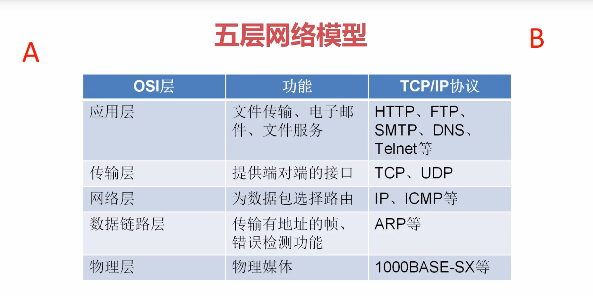
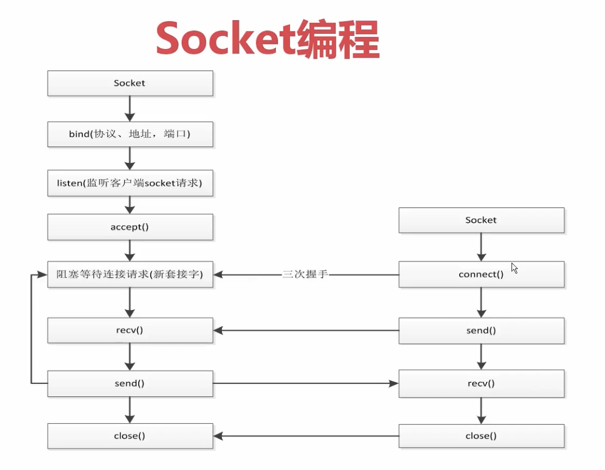

# python高级(03)--socket编程

## 概念理解

<mark>**五层网络模型：**</mark>




<mark>**左侧为server端，右侧为client端：**</mark>




## socket和server实现通信

`socket_server.py`

```python
import socket

server = socket.socket(socket.AF_INET, socket.SOCK_STREAM)
server.bind(('0.0.0.0', 8000))
server.listen(10)
sock, addr = server.accept()

# 获取从客户端发送的数据
# 一次获取1k的数据
data = sock.recv(1024)
print(data.decode('utf-8'))
sock.send("Hello {}".format(data.decode('utf-8')).encode('utf-8'))


sock.close()
server.close()

```


`socket_client.py`

```python
import socket

client = socket.socket(socket.AF_INET, socket.SOCK_STREAM)
client.connect(('127.0.0.1', 8000))

client.send('snoopy'.encode('utf-8'))
data = client.recv(1024)
print(data.decode('utf-8'))

client.close()
```


## socket实现聊天和多用户连接

`socket_server.py`

```python
import socket
import threading


server = socket.socket(socket.AF_INET, socket.SOCK_STREAM)
server.bind(('0.0.0.0', 8000))
server.listen(10)


def handle_sock(sock: socket.socket, addr):
    while True:
        print('new sock', sock, addr)
        recv_data = sock.recv(1024).decode('utf-8')
        print(recv_data)
        if recv_data == 'Q':
            break
        re_data = input()
        sock.send(re_data.encode('utf-8'))
    sock.close()


# 获取从客户端发送的数据
# 一次获取1k的数据
while True:
    sock, addr = server.accept()  # 阻塞

    client_thread = threading.Thread(target=handle_sock, args=(sock, addr))
    client_thread.start()

# sock.close()
# server.close()
```


`socket_client.py`

```python
import socket

client = socket.socket(socket.AF_INET, socket.SOCK_STREAM)
client.connect(('127.0.0.1', 8000))

while True:
    re_data = input()
    client.send(re_data.encode('utf-8'))
    if re_data == 'Q':
        break
    data = client.recv(1024)
    print(data.decode('utf-8'))

client.close()
```


## socket模拟http请求

```python
# requests -> urlib -> socket
import socket
from urllib.parse import urlparse


def get_url(url):
    # 通过socket请求html
    url = urlparse(url)
    host = url.netloc
    path = url.path
    if path == '':
        path = '/'

    # 建立socket连接
    client = socket.socket(socket.AF_INET, socket.SOCK_STREAM)
    # client.setblocking(False)
    client.connect((host, 80))  # 阻塞不会消耗CPU

    # 不停的询问连接是否建立好， 需要while循环不停的去检查状态
    # 做计算任务或者再次发起其他的连接请求
    
    client.send("GET {} HTTP/1.1\r\nHost:{}\r\nConnection:close\r\n\r\n".format(path, host).encode("utf8"))
    data = b""
    while True:
        d = client.recv(1024)
        if d:
            data += d
        else:
            break
    data = data.decode('utf8')
    html_data = data.split("\r\n\r\n")[0]
    print(html_data)
    client.close()


if __name__ == "__main__":
    import time
    start_time = time.time()

    for url in range(20):
        url = "http://shop.projectsedu.com/goods/{}/".format(url)
        get_url(url)
    print(time.time() - start_time)
```


