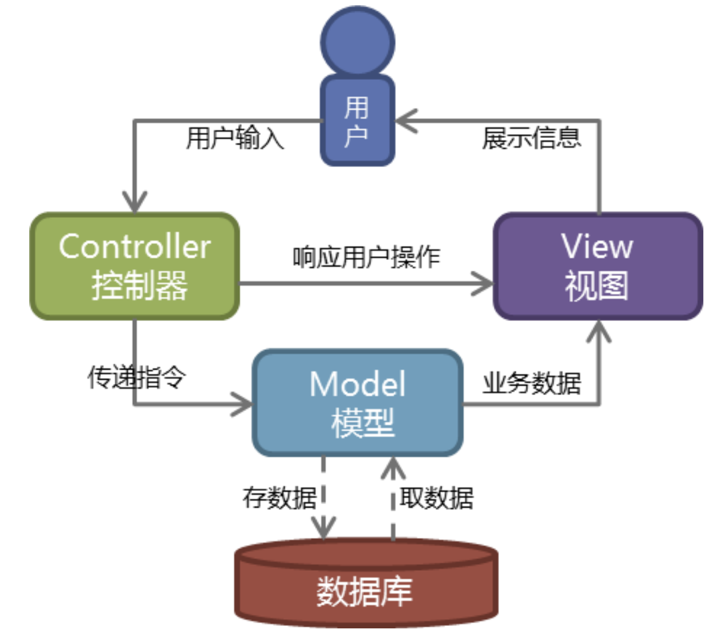
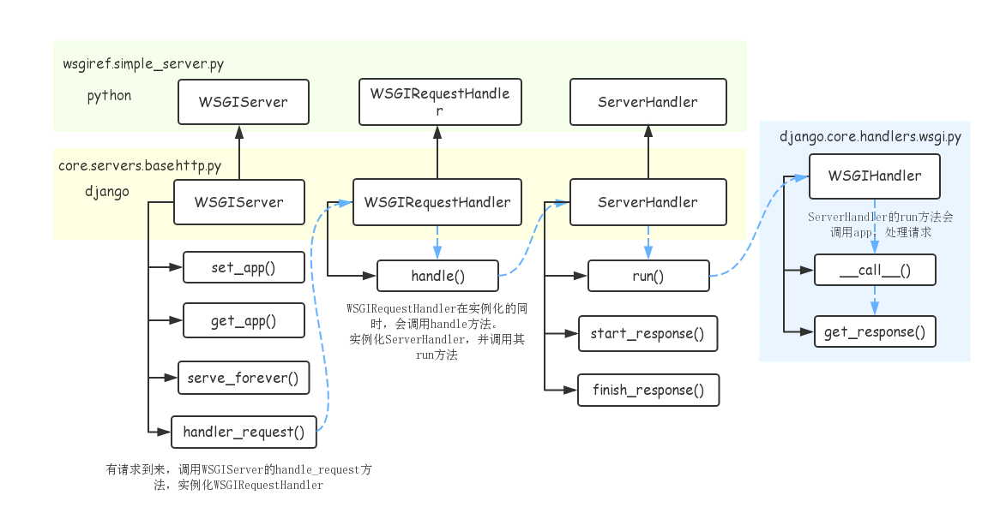

# web框架及Django概论

## HTTP协议

### 简介

HTTP协议是Hyper Text Transfer Protocol（超文本传输协议）的缩写,是用于从万维网（WWW:World Wide Web ）服务器传输超文本到本地浏览器的传送协议。

HTTP是一个属于应用层的面向对象的协议，由于其简捷、快速的方式，适用于分布式超媒体信息系统。它于1990年提出，经过几年的使用与发展，得到不断地完善和扩展。HTTP协议工作于客户端-服务端架构为上。浏览器作为HTTP客户端通过URL向HTTP服务端即WEB服务器发送所有请求。Web服务器根据接收到的请求后，向客户端发送响应信息。


### 特性

1. 基于TCP/IP协议

2. 基于请求-响应模式

   HTTP协议规定,请求从客户端发出,最后服务器端响应 该请求并返回。换句话说,肯定是先从客户端开始建立通信的,服务器端在没有 接收到请求之前不会发送响应。

   

3. 无状态保存

   

   HTTP是一种不保存状态,即无状态(stateless)协议。HTTP协议 自身不对请求和响应之间的通信状态进行保存。也就是说在HTTP这个 级别,协议对于发送过的请求或响应都不做持久化处理

   使用HTTP协议,每当有新的请求发送时,就会有对应的新响应产 生。协议本身并不保留之前一切的请求或响应报文的信息。这是为了更快地处理大量事务,确保协议的可伸缩性,而特意把HTTP协议设计成 如此简单的。

   可是,随着Web的不断发展,因无状态而导致业务处理变得棘手 的情况增多了。比如,用户登录到一家购物网站,即使他跳转到该站的 其他页面后,也需要能继续保持登录状态。针对这个实例,网站为了能 够掌握是谁送出的请求,需要保存用户的状态。HTTP/1.1虽然是无状态协议,但为了实现期望的保持状态功能, 于是引入了Cookie技术。有了Cookie再用HTTP协议通信,就可以管 理状态了。

4. 无连接

   无连接的含义是限制每次连接只处理一个请求。服务器处理完客户的请求，并收到客户的应答后，即断开连接。采用这种方式可以节省传输时间。


### http请求与响应协议

http协议包含由浏览器发送数据到服务器需要遵循的请求协议与服务器发送数据到浏览器需要遵循的响应协议。用于HTTP协议交互的信息被为HTTP报文。请求端(客户端)的HTTP报文 做请求报文,响应端(服务器端)的 做响应报文。HTTP报文本身是由多行数据构成的字文本。

1. 请求协议

   

   **GET与POST请求方式对比：**

   1. GET提交的数据会放在URL之后，以?分割URL和传输数据，参数之间以&相连，如EditBook?name=test1&id=123456. POST方法是把提交的数据放在HTTP包的请求体中.

   2. GET提交的数据大小有限制（因为浏览器对URL的长度有限制），而POST方法提交的数据没有限制。

      

2. 响应协议

   

   **响应状态码：**

   - 状态码的职值是当客户端向服务器端发送请求时, 返回的请求结果。借助状态码，用户可以知道服务器端是正常理了请求,还是出现了问题 。状态码如200 OK,以3位数字和原因组成。响应状态码有以下5种（详见下图）
   - 


### URL详解

URL是统一资源定位符，对可以从互联网上得到的资源的位置和访问方法的一种简洁的表示，是互联网上标准资源的地址。

URL的组成部分（如：http://www.google.com/home）：

- 协议部分：在Internet中可以使用多种协议，如HTTP，FTP等等。上面的例子中“http”就是在声明协议（在"http"后面的“//”为分隔符）
- 域名部分：上面的例子URL的域名部分为“http://www.google.com/home”。一个URL中，也可以使用IP地址作为域名使用（域名通过dns解析，最终访问的还是IP地址）。
- 端口部分：紧跟域名后面的就是端口，域名和端口之间使用“:”作为分隔符。端口不是一个URL必须的部分，如果省略端口部分，将采用默认端口（80）。
- 路径部分：以“/”字符区别路径中的每一个目录名称（如：http://www.google.com/home，中的home就是路径名称）。
- 文件名部分：从域名后的最后一个“/”开始到“？”为止，是文件名部分，如果没有“?”,则是从域名后的最后一个“/”开始到“#”为止，是文件部分，如果没有“？”和“#”，那么从域名后的最后一个“/”开始到结束，都是文件名部分（如：http://www.google.com/static/frontend/index/Luffy-study-logo.png）。本例中的文件名是“Luffy-study-logo.png”。文件名部分也不是一个URL必须的部分，如果省略该部分，则使用默认的文件名。
- 锚部分：从“#”开始到最后，都是锚部分。锚部分也不是一个URL必须的部分。
- 参数部分：从“？”开始到“#”为止之间的部分为参数部分，又称搜索部分、查询部分。参数可以允许有多个参数，参数与参数之间用“&”作为分隔符。


## Web

### 概述

Web应用程序指供浏览器访问的程序，通常也简称为Web应用。程序的最大好处是用户很容易访问应用程序，用户只需要有浏览器即可，不需要再安装其他软件。

**应用程序有两种模式C/S、B/S：**

- C/S（Client/Server）是客户端/服务器端程序，也就是说这类程序一般独立运行。
- B/S（Browser/Server）就是浏览器端/服务器端应用程序，这类应用程序一般借助谷歌，火狐等浏览器来运行。


Web应用程序一般是B/S模式。Web应用程序首先是“应用程序”，和用什么程序语言（如：java，python等）编写出来的程序没有什么本质上的不同。在网络编程的意义下，浏览器是一个socket客户端，服务器是一个socket服务端。

基于socket实现一个最简单的web应用程序

```python
import socket
# 创建socket对象
sock = socket.socket(socket.AF_INET, socket.SOCK_STREAM)

# 绑定IP和端口
sock.bind(("127.0.0.1", 8888))

# 监听
sock.listen(5)

while True:
    conn, addr = sock.accept()  # 等待连接

    data = conn.recv(1024)  # 接收数据
    print("请求信息====>  %s" % data)

    # 发送数据
    conn.send("HTTP/1.1 200 OK\r\nContent-Type: text/html;charset=utf-8\r\n\r\n".encode('utf-8'))
    conn.send("<h2>Hello World!</h2>".encode("utf-8"))
    conn.close()
```


### web服务

**对于web服务的理解：**

- `web`服务应该至少包含两个模块：`web`服务器和`web`应用程序，两个模块在功能和代码上解耦。
- `web`服务器负责处理`socket`调用、`http`数据解析和封装等底层操作。
- `web`应用程序负责业务处理、数据增删改查、页面渲染/生成等高层操作。
- `web`服务器一旦接收到`http`请求，经过自身的解析后就会调用`web`应用程序来处理业务逻辑，并得到`web`应用程序的返回值，再经过自身的封装发送给客户端。


### wsgi协议

在`web`服务器和`web`应用程序之间需要定义一个接口规则，这也叫协议，用于明确两者之间以什么样的形式交互数据。即：<mark>**`web`服务器应该以什么样的形式调用web应用程序，而`web`应用程序又应该定义成什么形式。**</mark>

`python`下规定的`web`服务的接口规则叫做`wsgi`，`wsgi`协议对于`server`和`application`的接口定义如下：

对于`server`调用规则的定义：

```python
response = application(environ, start_response)
```

对于`application`接口编码的定义：

```python
def application(environ, start_response):
    status = '200 OK'
    response_headers = [('Content-Type', 'text/plain'),]
    start_response(status, response_headers)
    
    return [b'hello',]
```

只要是遵从如上形式进一步封装`server`和`application`的，均称为实现了`wsgi`协议的`server/application`。


### wsgiref模块

最简单的Web应用就是先把HTML用文件保存好，用一个现成的HTTP服务器软件，接收用户请求，从文件中读取HTML，返回。

如果要动态生成HTML，就需要把上述步骤自己来实现。不过，接受HTTP请求、解析HTTP请求、发送HTTP响应都是苦力活，如果我们自己来写这些底层代码，还没开始写动态HTML呢，就得花个把月去读HTTP规范。

正确的做法是底层代码由专门的服务器软件实现，我们用Python专注于生成HTML文档。因为我们不希望接触到TCP连接、HTTP原始请求和响应格式，所以，需要**一个统一的接口协议来实现这样的服务器软件**，让我们专心用Python编写Web业务。这个接口就是**WSGI：Web Server Gateway Interface**。而**wsgiref模块就是python基于wsgi协议开发的服务模块。**

`python`内置提供了一个`wsigref`模块用于提供`server`，但是只能用于开发测试，`django`框架就是使用此模块作为它的`server`部分，也就说，实际生产中的`server`部分，还需要使用其他模块来实现。

`一个基于wsgi协议的简单web服务`

```python
from wsgiref.simple_server import make_server


def application(environ, start_response):  # wsgi协议规定的application部分的编码形式，可在此基础上扩展
    start_response('200 OK', [('Content-Type', 'text/html')])
    return [b'<h1>Hello Web!</h1>']


if __name__ == '__main__':
    httpd = make_server('', 8080, application)
    print("Serving HTTP on port 8080...")
    httpd.serve_forever()
```


### web框架


Web框架（Web framework）是一种开发框架，用来支持动态网站、网络应用和网络服务的开发。这大多数的web框架提供了一套开发和部署网站的方式，也为web行为提供了一套通用的方法。web框架已经实现了很多功能，开发人员使用框架提供的方法并且完成自己的业务逻辑，就能快速开发web应用了。

浏览器和服务器之间是基于HTTP协议进行通信的。也可以说web框架就是在以上十几行代码基础张扩展出来的，有很多简单方便使用的方法，大大提高了开发的效率。

任何`web`框架，可能没有实现`server`部分或者只实现一个简单的`server`，但是，`web`框架肯定实现了`application`部分。**`application`部分完成了对一次请求的全流程处理**，其中各环节都可以提供丰富的功能，比如请求和响应对象的封装、`model/template`的实现、中间件的实现等，让我们可以更加细粒度的控制请求/响应的流程。


### DIY一个web框架


`manage.py`--启动文件

```python
from wsgiref.simple_server import make_server
from urls import *


def application(environ, start_response):
    start_response('200 OK', [('Content-Type', 'text/html;charset=utf-8')])
    path = environ.get("PATH_INFO")
    func = None
    for item in urlpatterns:
        if path == item[0]:
            func = item[1]
            break
    if func:
        ret = func(environ)
    else:
        ret = not_found(environ)

    return [ret]


if __name__ == '__main__':
    httpd = make_server('', 8080, application)
    print('Serving HTTP on port 8080...')
    # 开始监听HTTP请求:
    httpd.serve_forever()
```

`urls.py`

```python
from views import *

urlpatterns = [
    ("/login/", login),
]
```

`views.py`

```python
def login(environ):
    with open("templates/login.html", "rb") as f:
        data = f.read()
        return data


def not_found(environ):
    ret = b'<h1>404 not found.!!!</h1>'
    return ret
```

`templates\login.html`

```html
<!DOCTYPE html>
<html lang="en">
<head>
    <meta charset="UTF-8">
    <title></title>
</head>
<body>
<form action="http://127.0.0.1:8080/login/" method="post">
    <p>用户名：<input type="text" name="user"></p>
    <p>密码：<input type="password" name="pwd"></p>
    <input type="submit">
</form>
</body>
</html>
```


## Django

### MVC与MTV

#### MVC模型



Web服务器开发领域里著名的MVC模式，所谓MVC就是把Web应用分为模型(M)，控制器(C)和视图(V)三层，他们之间以一种插件式的、松耦合的方式连接在一起

- **模型负责业务对象与数据库的映射(ORM)**，
- **视图负责与用户的交互(页面)**
- **控制器接受用户的输入调用模型和视图完成用户的请求**


#### MTV模型


Django的MTV模式本质上和MVC是一样的，也是为了各组件间保持松耦合关系，只是定义上有些许不同，Django的MTV分别是指：

- M 代表模型（Model）： 负责业务对象和数据库的关系映射(ORM)。
- T 代表模板 (Template)：负责如何把页面展示给用户(html)。
- V 代表视图（View）：  负责业务逻辑，并在适当时候调用Model和Template。

除了以上三层之外，还需要一个URL分发器，它的作用是将一个个URL的页面请求分发给不同的View处理，View再调用相应的Model和Template

一般是用户通过浏览器向我们的服务器发起一个请求(request)，这个请求回去访问视图函数，（如果不涉及到数据调用，那么这个时候视图函数返回一个模板也就是一个网页给用户），视图函数调用模型，模型去数据库查找数据，然后逐级返回，视图函数把返回的数据填充到模板中空格中，最后返回网页给用户。


### django中的server实现

`django`使用的底层`server`模块是基于`python`内置的`wsgiref`模块中的`simple_server`，每次`django`的启动都会执行如下`run`函数。`run`函数中会执行`serve_forever`，此步骤将会启动`socket_server`的无限循环，此时就可以循环提供请求服务，每次客户端请求到来，服务端就执行`django`提供的`application`模块。

`django`中`server`的启动----`django.core.servers.basehttp.py`

```python
"""
HTTP server that implements the Python WSGI protocol (PEP 333, rev 1.21).

Based on wsgiref.simple_server which is part of the standard library since 2.5.

This is a simple server for use in testing or debugging Django apps. It hasn't
been reviewed for security issues. DON'T USE IT FOR PRODUCTION USE!
"""

def run(addr, port, wsgi_handler, ipv6=False, threading=False, server_cls=WSGIServer):
    server_address = (addr, port)
    if threading:
        httpd_cls = type('WSGIServer', (socketserver.ThreadingMixIn, server_cls), {})
    else:
        httpd_cls = server_cls
    httpd = httpd_cls(server_address, WSGIRequestHandler, ipv6=ipv6)
    if threading:
        # ThreadingMixIn.daemon_threads indicates how threads will behave on an
        # abrupt shutdown; like quitting the server by the user or restarting
        # by the auto-reloader. True means the server will not wait for thread
        # termination before it quits. This will make auto-reloader faster
        # and will prevent the need to kill the server manually if a thread
        # isn't terminating correctly.
        httpd.daemon_threads = True
    httpd.set_app(wsgi_handler)
    httpd.serve_forever()
```

底层无限循环将作为`web`服务的主要驱动----`socektserver.py`

```python
def serve_forever(self, poll_interval=0.5):
    """Handle one request at a time until shutdown.

    Polls for shutdown every poll_interval seconds. Ignores
    self.timeout. If you need to do periodic tasks, do them in
    another thread.
    """
    self.__is_shut_down.clear()
    try:
        # XXX: Consider using another file descriptor or connecting to the
        # socket to wake this up instead of polling. Polling reduces our
        # responsiveness to a shutdown request and wastes cpu at all other
        # times.
        with _ServerSelector() as selector:
            selector.register(self, selectors.EVENT_READ)

            while not self.__shutdown_request:
                ready = selector.select(poll_interval)
                if ready:
                    self._handle_request_noblock()

                self.service_actions()
    finally:
        self.__shutdown_request = False
        self.__is_shut_down.set()
```

`server`对于`application`的调用----`wsgiref.handlers.py`

```python
def run(self, application):
    """Invoke the application"""
    # Note to self: don't move the close()!  Asynchronous servers shouldn't
    # call close() from finish_response(), so if you close() anywhere but
    # the double-error branch here, you'll break asynchronous servers by
    # prematurely closing.  Async servers must return from 'run()' without
    # closing if there might still be output to iterate over.
    try:
        self.setup_environ()
        self.result = application(self.environ, self.start_response)
        self.finish_response()
    except:
        try:
            self.handle_error()
        except:
            # If we get an error handling an error, just give up already!
            self.close()
            raise   # ...and let the actual server figure it out.
```


### django中的application实现

`django`的`application`模块是通过`WSGIHandler`的一个实例来提供的，此实例可以被`call`，然后根据`wsgi`的接口规则传入`environ`和`start_response`。所以本质上，`django`就是使用的内置`python`提供的`wsgiref.simple_server`再对`application`进行丰富的封装。大部分的`django`编码工作都在`application`部分。

`application`的编码定义部分----`django.core.handlers.wsgi.py`

```python
class WSGIHandler(base.BaseHandler):
    request_class = WSGIRequest

    def __init__(self, *args, **kwargs):
        super().__init__(*args, **kwargs)
        self.load_middleware()

    def __call__(self, environ, start_response):
        set_script_prefix(get_script_name(environ))
        signals.request_started.send(sender=self.__class__, environ=environ)
        request = self.request_class(environ)
        response = self.get_response(request)

        response._handler_class = self.__class__

        status = '%d %s' % (response.status_code, response.reason_phrase)
        response_headers = list(response.items())
        for c in response.cookies.values():
            response_headers.append(('Set-Cookie', c.output(header='')))
        start_response(status, response_headers)
        if getattr(response, 'file_to_stream', None) is not None and environ.get('wsgi.file_wrapper'):
            response = environ['wsgi.file_wrapper'](response.file_to_stream)
        return response
```


### django的底层调用链




